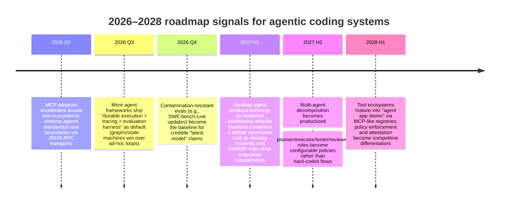

# AI Agent Landscape 2026 for a Node.js/Electron Multi‑Agent Coding System

## Executive summary

The 2026 “agentic coding” landscape has converged on a few pragmatic truths: (a) strong foundation models now dominate outcomes on credible benchmarks (especially SWE‑bench Verified), (b) orchestration scaffolds are shifting from elaborate toolchains toward **stateful, observable, policy‑constrained workflows**, and (c) production viability is more about **sandboxing, evaluation, and operational controls** than about “more agents.” citeturn31search0turn43view0turn14search4turn16search0

A major inflection in 2024–2025 was not merely better models, but **better measurement and harnesses**: OpenAI’s collaboration on **SWE‑bench Verified** introduced a human‑validated subset and emphasized containerized evaluation harness reliability—explicitly to reduce under/overestimation of model autonomy and to improve benchmark feasibility. citeturn42view0turn22search6 This catalyzed a steady migration from “prompt demos” toward reproducible, harness‑driven agent engineering. citeturn42view0turn22search1

As of March 2026, the official SWE‑bench Verified leaderboard snapshot shows frontier “high reasoning” model entries clustered around ~70% resolved (e.g., **Kimi K2.5 70.80**, **DeepSeek V3.2 70.00**, **Gemini 3 Pro 69.60**). citeturn31search0turn31search2 The operational implication: orchestration frameworks matter, but **evaluation discipline + secure execution environments** matter more for converting benchmark‑level capability into real product reliability. citeturn14search4turn17search3turn18search3

For a Node.js/Electron multi‑agent coding product, the most transferable, production‑grade pattern in 2026 is: **Electron UI as a secure front-end + a supervisory “agent runtime” in the main process + isolated worker processes/containers for tool execution**, with end‑to‑end tracing, deterministic replay, and explicit budgets (tokens, tool calls, time, filesystem scope). citeturn49view0turn6search1turn16search0turn14search4turn18search2

Technically, Electron 41 (March 2026) ships with **Node v24.14.0**, enabling modern Node runtimes inside the desktop envelope while also introducing security‑relevant enhancements (e.g., an **ASAR Integrity digest** feature on macOS for additional tamper detection when using ASAR Integrity). citeturn49view0turn8search1 At the same time, Electron remains security‑sensitive: context isolation, sandboxing, and strict IPC boundaries are mandatory baselines, not nice‑to‑haves. citeturn7search17turn5search2turn6search1

The report’s core recommendation is to treat your system as **two products**: (1) an “agent workflow runtime” (state machine / graph with durable execution, tool permissions, and evaluation hooks), and (2) a “developer workstation shell” (sandboxed code runner + repo manager + credentials vault). That split is what separates production‑proven agent systems (observability + containment + regression evaluation) from hype (unbounded autonomy in unsafe environments). citeturn36view0turn16search3turn14search4turn17search3turn18search3

## Landscape snapshot and major breakthroughs

### Breakthroughs that reshaped agentic coding in 2024–2025

SWE‑agent (2024) formalized the idea that **agent‑computer interfaces (ACIs)** materially change outcomes: the paper explicitly studies how interface design affects language‑model agents’ software engineering performance, reporting state‑of‑the‑art results on SWE‑bench and HumanEvalFix at the time (pass@1 12.5% on SWE‑bench and 87.7% on HumanEvalFix in that evaluation). citeturn47view0 This anchored a research/engineering agenda around tool interfaces, not just prompts. citeturn47view0

OpenAI’s SWE‑bench Verified work (Aug 2024; updated Feb 2025) was an equally important milestone because it reframed SWE‑bench as a **preparedness‑relevant “model autonomy” signal** and documented why the original benchmark could systematically underestimate (or mis-measure) autonomous SWE capability due to underspecification, brittle tests, and environment setup failures. citeturn42view0 They report GPT‑4o resolving 33.2% on SWE‑bench Verified in that study, and highlight containerized harness work to improve evaluation reliability. citeturn42view0turn22search1

OpenHands / OpenDevin (2024) pushed the OSS frontier from “toy agents” to a **platform** framing: agents that “write code, interact with a command line, and browse the web,” with explicit attention to sandboxed environments, multi‑agent coordination, and benchmark integration. citeturn48search0turn45view0 That shift matters for your product: it normalizes the architecture you likely need (event streams, sandbox runtimes, evaluation harnesses) rather than treating them as optional. citeturn48search2turn45view0

A striking 2025–2026 trend is **minimalist scaffolding + strong models**: the mini‑SWE‑agent project argues that as models get more capable, heavy scaffolding becomes less necessary; it emphasizes linear histories (debuggability), bash‑only action interfaces, and sandbox friendliness via stateless command execution. citeturn43view0turn23view0 Whether or not one accepts all performance claims, the thesis is widely echoed: model capability is increasingly the binding constraint; scaffolding value is in **safety, observability, and state management**, not in clever prompt tricks. citeturn43view0turn14search4turn16search0

Finally, standardization of tool/context integration accelerated via **Model Context Protocol (MCP)**, an open protocol using JSON‑RPC with standardized transports (stdio and “Streamable HTTP”), explicitly aimed at connecting LLM apps to external tools/data sources in a uniform way. citeturn11search12turn11search21turn10search8 This is strategically relevant for an Electron desktop agent: MCP offers a clean boundary between your agent runtime and tool servers (IDE, git, ticketing, secrets, browsers). citeturn11search21turn11search5

### Top teams and ecosystems shaping 2026

The ecosystem is “bimodal”: proprietary labs/platforms push frontier model capability and integrated agent tooling, while OSS ecosystems operationalize end‑to‑end stacks and reproducible harnesses.

**Selected teams/platforms and what they anchor in 2026**

| Team / ecosystem | What they ship that matters for agentic coding | Evidence anchors |
|---|---|---|
| entity["company","OpenAI","ai research company"] | SWE‑bench Verified evaluation framing (model autonomy), agent tooling + traces/graders; agent SDK ecosystem | SWE‑bench Verified report and Preparedness framing; tracing/grading docs; Agents SDK docs citeturn42view0turn16search3turn16search6 |
| entity["company","Anthropic","ai company"] | MCP roots/standardization influence and broad ecosystem adoption (protocol + servers pattern) | MCP definition/spec + transports; OpenAI Responses API references MCP support citeturn11search12turn11search21turn10search8 |
| entity["organization","Google DeepMind","ai research lab"] / entity["company","Google Cloud","cloud provider"] | Enterprise coding assistance + “agents across SDLC” positioning (practical adoption driver) | Gemini Code Assist positioning and overview citeturn12search2turn12search6 |
| entity["company","Microsoft","software company"] | Multi‑agent orchestration patterns (Semantic Kernel), AutoGen lineage, “Agent Framework” push toward GA | SK orchestration patterns post; AutoGen docs/paper; Agent Framework RC announcement citeturn51view0turn50view0turn50view1turn46view0 |
| entity["company","GitHub","code hosting platform"] | “Coding agent” integrated into PR workflows (issue → changes → PR → review loop) | Copilot coding agent description/PR workflow citeturn12search20turn12search4 |
| entity["company","Amazon Web Services","cloud provider"] | Agentic developer assistant positioning; unit test generation & automation emphasis | Amazon Q Developer overview + features citeturn12search1turn12search5turn12search9 |
| entity["company","Replit","online IDE company"] | “Agent‑first” product strategy and parallel agent task execution narrative | Replit “agent‑first” retrospective + Agent 4 positioning citeturn13search13turn13search9turn13search17 |
| entity["company","JetBrains","software tools company"] | IDE‑embedded AI assistant + emerging “coding agent” direction in pricing/product language | JetBrains AI + AI Assistant docs/pricing references citeturn13search1turn13search11turn13search7 |
| entity["company","Sourcegraph","code intelligence company"] | Code context + “agents” framing for large codebases (context retrieval as product moat) | Sourcegraph positioning + Cody/assistant material citeturn12search3turn12search11turn12search23 |
| entity["organization","OpenHands","open source agent platform"] | OSS “agent platform” with CLI/GUI + sandbox + evaluation hooks | OpenHands repo + OpenHands/OpenDevin paper framing citeturn45view0turn48search2 |

Table note: rows reflect “ecosystem gravity,” not an exhaustive ranking; each entry is supported by the cited product docs/papers/blogs. citeturn45view0turn42view0turn12search20turn51view0turn12search1

## State of the art in multi‑agent systems

### What “multi‑agent” means in 2026 practice

In 2026 production discussions, “multi‑agent” rarely means unconstrained simulated societies. It typically means a **workflow of specialized roles** (planner, coder, reviewer, tester, security analyst, release manager) coordinated by a deterministic orchestration layer with durable state and human approval gates. This framing matches (a) Semantic Kernel’s explicit orchestration patterns (sequential, concurrent, group chat, handoff, Magentic‑style) and (b) LangGraph’s emphasis on long‑running stateful agents with durable execution and human‑in‑the‑loop controls. citeturn51view0turn36view0turn16search6

A useful mental model is: *agents are not threads; they are policy‑bounded state machines that can ask for actions.* The important engineering work is to (1) define state transitions, (2) constrain tools, and (3) make runs observable and replayable. LangGraph’s README highlights durable execution and memory/persistence as first‑class, and OpenAI’s Agents SDK stresses traces and workflow inspection/optimization. citeturn36view0turn16search6turn16search3

image_group{"layout":"carousel","aspect_ratio":"16:9","query":["multi-agent orchestration architecture diagram manager worker agents","state machine agent workflow graph diagram","human in the loop agent workflow diagram"]}

### Coordination patterns that consistently transfer to coding agents

The patterns below recur across multiple ecosystems and are directly applicable to a multi‑agent coding system:

**Pipeline / sequential orchestration** is the default for coding tasks because it matches SDLC order: interpret issue → plan → implement → test → review → package. Semantic Kernel documents sequential orchestration as a pipeline where each agent passes output to the next. citeturn51view0

**Parallel / concurrent orchestration** is best for “wide” subtasks: exploring repository areas, generating alternative patches, or running independent static analysis. Semantic Kernel describes concurrent orchestration as parallel processing with aggregation. citeturn51view0

**Handoff / delegation** avoids “one giant prompt” by transferring control between specialists when the task context demands it. Semantic Kernel describes handoff orchestration; OpenAI Agents SDK highlights handoffs as a core concept. citeturn51view0turn16search6turn35view0

**Group‑chat / moderated debate** (with a manager) is useful when you need critique loops—e.g., “generate patch” then “adversarial reviewer tries to break it.” Semantic Kernel’s group chat orchestration formalizes a manager coordinating who speaks next and when humans are involved. citeturn51view0

**Minimalist action interface** (often “bash + filesystem”) is increasingly competitive because it generalizes across models and simplifies sandboxing. mini‑SWE‑agent explicitly argues for bash‑only actions and linear history for debuggability and sandbox friendliness. citeturn43view0turn17search3

### Best practices for reliability, safety, and controllability

**Treat prompt injection as a primary threat model, not an edge case.** OWASP’s Top 10 for LLM Applications (2025) defines prompt injection as the top risk category (LLM01) and links it to bypassing intended behavior and safety controls. citeturn14search4turn14search0 For coding agents, this includes indirect injection through retrieved files, issues, PR comments, or documentation. citeturn14search10turn14search2

**Do not execute untrusted code “in-process.”** Node’s own documentation states the `node:vm` module is *not* a security mechanism and must not be used to run untrusted code. citeturn17search3 Similar “sandbox in JS” approaches remain fragile; for example, vm2 has repeated sandbox escape advisories, including a 2026 advisory enabling arbitrary code execution by escaping the sandbox. citeturn41search2turn41search3

**Prefer OS/VM/container sandboxing with explicit hardening controls.** Docker’s security documentation emphasizes reducing privilege (non‑root) and using mechanisms like seccomp allowlists and user namespace remapping; rootless mode is explicitly positioned to mitigate daemon/runtime vulnerabilities. citeturn18search3turn18search2turn18search1turn18search22 For stronger isolation in high‑risk execution, gVisor is positioned as a sandboxed container runtime that provides VM‑like security properties with a smaller footprint, and Firecracker microVMs provide hardware‑virtualization isolation with fast start times (often cited for multi‑tenant security). citeturn17search5turn17search8turn17search2turn17search6

**Make observability non‑optional.** OpenTelemetry positions itself as a vendor‑neutral framework for traces/metrics/logs; its Node.js getting started guide documents instrumenting traces and metrics. citeturn16search0turn16search18 OpenAI’s traces and graders are explicitly designed to inspect workflows and evaluate/grade performance, and LangSmith provides end‑to‑end tracing for LangGraph applications. citeturn16search3turn16search2turn16search6

## Benchmarks, benchmark leaders, and how to evaluate your system

### Benchmarks that matter for coding agents in 2026

A recurring production pitfall is optimizing for a single benchmark (or for “vibes”). The current best practice is to use a **portfolio of evaluations** that cover: repo‑level issue fixing, real‑time contamination resistance, and computer‑use environments.

**Core benchmark families**

| Benchmark | What it measures | Why it matters for your architecture |
|---|---|---|
| SWE‑bench (Full) / SWE‑bench Verified | Patch generation that resolves real GitHub issues, validated via tests; Verified is human‑filtered to reduce problematic tasks | Anchors “issue → patch → tests pass” loop; Verified improves evaluative reliability citeturn22search6turn42view0turn22search13 |
| SWE‑bench Lite | Lower-cost subset for faster iteration | Enables frequent regression testing in CI for agent changes citeturn23view0turn22search4 |
| SWE‑bench Multilingual / Multimodal | Cross-language tasks and tasks with visual elements | Relevant if your product supports multi-language repos + UI/log artifacts citeturn22search7turn20view0 |
| SWE‑bench‑Live | Continuously updated dataset aimed at contamination‑resistant evaluation, planned monthly updates | Critical for “real world” validity over time; reduces overfitting to a static test set citeturn22search11turn22search2 |
| WebArena | Web browsing / web task completion benchmark | Covers “agent in browser” behaviors, relevant to Electron-integrated browsing tools citeturn3search3turn48search2 |
| OSWorld | Operating-system / desktop task automation benchmark | Probes general computer-use capability (often still far from perfect), valuable for realism checks citeturn3search2 |
| CodeClash | “Goal-oriented developer” evaluation framing (not just task scripts) | Pushes evaluation toward realistic developer goals and long-horizon behavior citeturn20view0turn3search1 |

Table note: entries are anchored in official benchmark pages/repos/papers. citeturn22search6turn22search11turn3search2turn3search3turn20view0

### Benchmark leaders as a 2026 capability proxy

As of March 2026 (snapshot from the official SWE‑bench leaderboard), top entries on SWE‑bench Verified cluster near ~70% resolved, including **Kimi K2.5 70.80**, **DeepSeek V3.2 70.00**, and **Gemini 3 Pro 69.60**. citeturn31search0turn31search2

This is a dramatic increase relative to 2024 public baselines (e.g., OpenAI’s SWE‑bench Verified report documents GPT‑4o at 33.2% in that evaluation framing), underscoring that **model capability improved and harnesses matured**, but also that adoption requires careful containment and measurement. citeturn42view0turn14search4

### How to evaluate a Node/Electron multi‑agent coding system without fooling yourself

The SWE‑bench tooling and docs emphasize that evaluation runs produce structured result artifacts (e.g., `results.json`, `instance_results.jsonl`), which is exactly what you want for CI-driven regression and per-failure debugging. citeturn22search1turn22search5

A production-grade evaluation stack for your product should include:

1. **External benchmarks** (SWE‑bench Verified/Lite; optionally SWE‑bench‑Live) for comparability and contamination-resistant drift checks. citeturn42view0turn22search11  
2. **Internal “golden tasks”** derived from your own repos (issues/PRs) with deterministic harnesses, mirroring SWE‑bench’s “tests before fail, after pass” structure. This is an inference from SWE‑bench’s design (issue+repo → patch → FAIL_TO_PASS + PASS_TO_PASS tests) and OpenAI’s critique of underspecification; internal tasks must be well-scoped and harnessed to avoid measuring noise. citeturn42view0turn22search6  
3. **Trajectory review + tracing** so you can diagnose where an agent fails (planning, tool choice, patch quality, test execution, cost blowups). OpenAI traces/graders and LangGraph/LangSmith tracing support this kind of workflow-level observability. citeturn16search3turn16search2turn36view0

## Node.js/Electron implementation approaches with trade-offs

### Baseline constraints imposed by Electron’s security model

Electron is effectively a Chromium browser with Node.js integration, which means your architecture must start from Electron’s security posture:

- Context isolation is default behavior in Electron (since v12 per Electron security docs), and is central to preventing renderer scripts from mutating privileged globals. citeturn7search17turn6search1  
- Electron’s sandboxing model exists and should be used; BrowserWindow `sandbox` is documented with defaults and behavior implications. citeturn5search2  
- A Content Security Policy (CSP) is explicitly recommended for content loaded inside Electron to reduce injection/XSS risk. citeturn14search7turn6search1  

For an agentic coding product, these points are not generic web hygiene: a compromised renderer can become an “agent tool” for stealing tokens, editing repos, or exfiltrating user code unless IPC is strictly permissioned. citeturn6search1turn14search4

image_group{"layout":"carousel","aspect_ratio":"16:9","query":["Electron process model main process renderer preload diagram","Electron IPC contextBridge diagram","Electron sandbox security architecture diagram"]}

### Process models for multi‑agent runtimes in Electron

A practical way to think about architecture is choosing *where* the orchestrator lives and *how* tool execution is isolated.

**Orchestrator in Electron main process (recommended default)**  
The main process runs privileged Node code and can supervise worker processes. Electron’s process model explicitly distinguishes main vs renderer responsibilities, which maps well to “agent runtime vs UI.” citeturn6search1turn5search21

**Tool execution in out-of-process sandboxes (strongly recommended)**  
Running generated code “in-process” is unsafe (Node `vm` warning); therefore, tool execution should happen in containers/microVMs or at least separate OS processes under strict OS controls. citeturn17search3turn18search3turn17search6

**Common execution isolation tiers (from weakest to strongest)**

| Tier | Mechanism | Pros | Cons / risks |
|---|---|---|---|
| Separate Node process | `child_process.fork()` or `spawn()` for each agent/tool worker | Simpler than containers; isolates crashes | Still shares host OS; must sandbox filesystem/network carefully; prompt-injection-driven command execution remains dangerous citeturn17search3turn14search4 |
| Container sandbox | Docker rootless + seccomp/userns + minimal images | Stronger isolation; standardized; reproducible harness | Cross‑platform friction (esp. user machines); Docker socket exposure is sensitive; requires hardening citeturn18search2turn18search1turn18search22turn45view0 |
| Sandboxed container runtime | gVisor (`runsc`) | Additional kernel isolation; designed for running untrusted workloads | Primarily Linux; operational complexity on desktop citeturn17search5turn17search8 |
| MicroVM | Firecracker | Strong isolation + fast startup (microVM design) | Best fit in server contexts; desktop integration non-trivial citeturn17search2turn17search6 |

### IPC patterns for agent workflows

Electron encourages IPC between renderer and main process; the main security requirement is to expose **narrow, validated APIs** via preload scripts rather than giving the renderer broad Node access.

**Secure IPC “RPC” pattern (renderer → preload → main)**

```ts
// preload.ts
import { contextBridge, ipcRenderer } from "electron";

contextBridge.exposeInMainWorld("agentAPI", {
  runTask: (task: { title: string; prompt: string; repoPath: string }) =>
    ipcRenderer.invoke("agent:runTask", task),
  cancelTask: (taskId: string) => ipcRenderer.invoke("agent:cancelTask", { taskId }),
  onEvent: (cb: (evt: any) => void) => {
    const handler = (_: unknown, evt: any) => cb(evt);
    ipcRenderer.on("agent:event", handler);
    return () => ipcRenderer.off("agent:event", handler);
  },
});
```

```ts
// main.ts
import { ipcMain } from "electron";
import { z } from "zod";

const RunTaskSchema = z.object({
  title: z.string().min(1).max(200),
  prompt: z.string().min(1).max(100_000),
  repoPath: z.string().min(1),
});

ipcMain.handle("agent:runTask", async (_evt, payload) => {
  const task = RunTaskSchema.parse(payload);
  // enqueue into orchestrator; return stable taskId
  return orchestrator.enqueue(task);
});

ipcMain.handle("agent:cancelTask", async (_evt, { taskId }) => {
  await orchestrator.cancel(taskId);
  return { ok: true };
});
```

This design aligns with Electron’s security guidance around isolating privileged APIs and reduces the blast radius if a renderer is compromised. citeturn6search1turn7search17turn5search4turn40search0

**Event streaming over IPC**  
Agent runs are long-horizon; you want incremental updates. OpenAI Agents SDK supports streaming partial results and maintaining a trace, which conceptually maps to streaming events to the UI. citeturn35view0turn16search6

### Latency and cost control

OWASP explicitly calls out “Model Denial of Service” (LLM04) as an LLM risk class: resource-heavy prompts/calls can disrupt service and drive costs. citeturn14search4 For desktop agents, this translates to:

- **Hard budgets** per run: token ceilings, step limits, max wall time, max tool invocations. (SWE‑bench leaderboards themselves model step/cost limits and provide cost vs resolved analysis views, reinforcing that these constraints matter.) citeturn23view0turn14search4  
- **Concurrency control**: cap parallel agents, and use parallelism only where it adds information (search/analysis) rather than duplicating work. Semantic Kernel’s concurrent orchestration pattern is explicitly designed for parallel work with aggregation. citeturn51view0  
- **Caching & memoization** at the tool layer (repo scans, embeddings, test discovery). AutoGen’s docs include dedicated guidance on caching and long contexts, reflecting that cost and context limits are recurring issues. citeturn50view0  

## Concrete stack recommendations with exact versions

This section lists a **pinned baseline** that is plausible for production as of **2026‑03‑18**. Versions reflect “latest stable” or “recommended stable line” in cited sources; for production you should still pin via lockfiles and run security scanning on every update. citeturn49view0turn18search6turn14search4

### Runtime and desktop shell

- **Electron**: target Electron **41.x** (Electron 41 released March 10, 2026; Electron recommends installing 41.0.2 when upgrading due to early patch fixes). citeturn49view0  
- **Node.js**: Electron 41 includes **Node v24.14.0**. If you also ship a separate local agent service, align it to Node **24.14.0 LTS** to match the Electron runtime and reduce ABI/library drift. citeturn49view0turn8search1  
- **TypeScript**: **5.9.3** (npm latest stable at time of source). citeturn39search2turn39search10  

### Agent orchestration frameworks

| Framework | Best fit in your architecture | Maturity signal | License signal |
|---|---|---|---|
| OpenAI Agents SDK (TypeScript) `@openai/agents` | Provider-agnostic agent framework with guardrails, handoffs, sessions, tracing; strong for multi-agent workflows | GitHub repo shows active releases (e.g., v0.7.2 March 2026) and built-in concepts (handoffs, guardrails, tracing) | MIT (repo) citeturn35view0 |
| LangGraph (JS + Python ecosystem) | Stateful workflow graph + durable execution + human-in-the-loop; good when you want explicit state transitions | README emphasizes durable execution, memory, production-ready deployment; large adoption signals | MIT (repo) citeturn36view0 |
| AutoGen | Multi-agent conversation abstraction with customizable conversable agents; useful reference design even if you don’t adopt directly in Node | Paper + docs describe multi-agent conversation framework, tools, humans, caching/observability topics | Described as open-source in paper; confirm repo license before adoption citeturn46view0turn50view0 |
| Semantic Kernel multi-agent orchestration | Clear articulation of orchestration patterns and runtime; valuable design reference | Microsoft post defines multiple orchestration patterns and consistent runtime invocation model | Licenses vary by package/repo; treat as reference unless adopting .NET/Python services citeturn51view0turn50view1 |

### Tool integration standard

- **MCP spec & transports**: MCP is JSON‑RPC based and defines standard transports: **stdio** and **Streamable HTTP**; clients “should” support stdio when possible. citeturn11search21turn11search12  
- **MCP TypeScript SDK**: modelcontextprotocol/typescript-sdk release tags show ongoing development (e.g., v1.27.1 tag in Feb 2026). citeturn11search4turn11search12  

### LLM provider clients in Node

The following package versions are useful anchors for a Node/Electron agent runtime (exact package versions are sourced from npm pages):

- `openai` **4.95.0** (latest on npm at time of source). citeturn9search0  
- `@openai/agents` **0.7.1** on npm (and v0.7.2 release on GitHub shortly after). citeturn9search4turn35view0  
- `@anthropic-ai/sdk` **0.56.0** (npm). citeturn9search1  

### Orchestration, processes, and job control

- **Schema validation for IPC and tool inputs**: `zod` **4.3.6**. citeturn40search0  
- **Process execution** (for safe, explicit shell runs under supervision): `execa` **9.6.1**. citeturn40search2  
- **Reactive event bus** for agent run events: `rxjs` **7.8.2**. citeturn40search1turn40search17  

### Testing, CI, and desktop automation

- **Vitest**: **4.1.0** (npm). citeturn39search3  
- **Playwright**: **1.58.2** (npm), with experimental Electron automation support (`_electron`). citeturn38search2turn15search0  
- **Playwright “Test Agents” (pattern)**: Playwright release notes describe “planner / generator / healer” agent definitions for building and repairing tests, reinforcing that multi-agent decomposition patterns are relevant even in testing toolchains. citeturn38search6  

### Observability and crash reporting

- **OpenTelemetry Node SDK**: `@opentelemetry/sdk-node` **0.213.0** (npm) and auto-instrumentation (`@opentelemetry/auto-instrumentations-node`) is explicitly positioned for capturing telemetry without deep code changes. citeturn38search4turn16search1turn16search0  
- **OpenTelemetry API**: `@opentelemetry/api` **1.9.0** (npm). citeturn38search0  
- **Sentry for Electron**: `@sentry/electron` latest is documented as **7.10.0** in Sentry’s Electron guide. citeturn38search9turn15search3  

### Packaging, updates, and supply-chain posture

- **Electron Forge CLI**: `@electron-forge/cli` **7.11.1** (npm). citeturn39search0turn15search1  
- **electron-builder**: **26.8.1** (npm). citeturn39search1turn15search2  
- **Electron 41 supply-chain/security note**: Electron 41 introduces ASAR Integrity digest support (macOS) for additional tamper detection when using ASAR Integrity, and notes support plans via Electron Forge. citeturn49view0  

### Sandboxing and container integration

- **Docker hardening primitives**: rootless mode, seccomp profiles, user namespace remapping are documented as mitigation mechanisms. citeturn18search2turn18search1turn18search22  
- **Node “vm is not a sandbox”**: do not run untrusted code via `node:vm`. citeturn17search3  
- **If you must do “JS sandboxing,” treat it as unsafe**: vm2 has repeated sandbox escape advisories; one 2026 advisory explicitly enables escaping the sandbox and running arbitrary code. citeturn41search2turn41search6  
- **Container control from Node**: `dockerode` **4.0.9** (npm). citeturn40search3  

## Pitfalls, failure modes, and monitoring/alerting

### Failure modes unique to agentic coding systems

**Prompt injection and instruction/data confusion**  
LLM-integrated apps blur the line between instructions and data, enabling indirect prompt injection through retrieved content; this is a known research attack vector and OWASP’s #1 LLM risk category in 2025. citeturn14search10turn14search4turn14search0  
Mitigation: strict separation of trusted system/developer instructions from untrusted repo content; tool outputs must be treated as untrusted; enforce allowlists, structured outputs, and human approval for high-impact actions (push, delete, credential access). citeturn14search4turn35view0turn6search1

**Unsafe code execution / sandbox escape**  
Running agent-generated code is the fastest path to catastrophic failure. Node explicitly disclaims `vm` as a security mechanism; vm2 has had sandbox escape vulnerabilities including 2026 advisories. citeturn17search3turn41search2  
Mitigation: container/microVM execution with filesystem/network restrictions; Docker rootless + seccomp + user namespace remap are concrete hardening layers; prefer gVisor/Firecracker for higher-risk multi-tenant or remote execution scenarios. citeturn18search2turn18search1turn18search22turn17search5turn17search6

**Cost runaway and “model DoS”**  
OWASP explicitly frames model DoS risk (LLM04), and SWE‑bench’s leaderboard UI itself emphasizes cost/step limits as metrics of interest—telegraphing that the field now treats budgets as first-class constraints. citeturn14search4turn23view0  
Mitigation: budgets per run (tokens, steps, tools, wall time), circuit breakers, progressive summarization, and concurrency caps; store cost telemetry per agent/tool call and feed it into alerting. citeturn16search0turn14search4turn50view0

**Context bloat and “reasoning degradation”**  
Long-running agents accumulate logs, diffs, and outputs; toolchains (including AutoGen docs) explicitly address handling long contexts and caching. citeturn50view0  
Mitigation: adopt **stateful memory with compaction**, retain raw artifacts on disk but summarize into structured state; store diffs and test logs as attachments rather than prompt text; rehydrate only on demand. This is consistent with graph/stateful orchestration claims (LangGraph durable execution + memory) and OpenAI “sessions” management. citeturn36view0turn35view0turn16search6

**Electron-specific security pitfalls**  
Electron apps inherit web security risks; Electron security docs emphasize context isolation and CSP, and Electron 41 notes security-related changes (ASAR integrity digest, and some behavior changes like PDF rendering changes). citeturn6search1turn14search7turn49view0  
Mitigation: keep renderer unprivileged, use preload `contextBridge`, strictly validate IPC inputs (schemas), and avoid loading remote content unless absolutely necessary with tight CSP. citeturn7search17turn5search4turn14search7turn40search0

### Monitoring and alerting blueprint

A minimal-but-production-real monitoring stack:

- **Traces**: instrument every agent run end-to-end; use OpenTelemetry or platform traces. OpenAI traces/graders and OpenTelemetry Node guides both emphasize trace capture and workflow inspection. citeturn16search3turn16search0turn16search8  
- **Cost and policy violations**: alert on budget thresholds, repeated tool failures, repeated sandbox kills, and “high-risk tool call attempts” blocked by guardrails. (This aligns with OWASP’s model DoS risk category and guardrail concepts in agent SDKs.) citeturn14search4turn35view0  
- **Crash + performance telemetry**: capture Electron crashes and performance regressions with a desktop-grade reporter (e.g., Sentry’s Electron SDK is explicitly designed for capturing errors). citeturn15search3turn38search9  
- **Evaluation regressions in CI**: run a “lite harness” frequently (SWE‑bench Lite style) and run heavier suites nightly; SWE‑bench tooling produces structured artifacts for analysis. citeturn22search1turn23view0  

## Production‑proven vs hype, and a transferable roadmap

### What is production-proven in 2026

**Stateful orchestration + observability is production-proven.** LangGraph explicitly markets durable execution, human-in-the-loop capabilities, and production-ready deployment as core value; OpenAI Agents SDK emphasizes full traces and guardrails; and OpenTelemetry provides a widely adopted instrumentation standard. citeturn36view0turn35view0turn16search18turn16search3

**MCP-style tool boundaries are becoming the “USB-C” of agents.** MCP’s JSON‑RPC protocol definition and transports establish a clean separation between agent runtimes and tool/data servers; OpenAI’s Responses API explicitly references MCP tool support (local and remote) as part of tool integration. citeturn11search21turn10search8turn11search12

**Desktop automation for testing is stabilizing around Playwright patterns.** Playwright documents experimental Electron automation; Playwright release notes even introduce “Test Agents” patterns (planner/generator/healer) that mirror multi-agent decomposition in practice. citeturn15search0turn38search6

### What remains hype or fragile

**“Run arbitrary untrusted code inside Node” is hype (and unsafe).** Node docs explicitly warn against using `node:vm` as a security boundary; vm2 continues to have sandbox escapes. citeturn17search3turn41search2

**“Full autonomy without budgets or approvals” is not production-ready.** OWASP frames prompt injection and model DoS risks; OpenAI’s own preparedness framing for SWE‑bench underscores the need to carefully evaluate and forecast autonomy, not assume it. citeturn14search4turn42view0

**“Benchmark scores = product reliability” is false.** The SWE‑bench Verified work highlights benchmark artifacts (underspecification, brittle tests, environment issues) and the need for improved harnessing; SWE‑bench‑Live exists explicitly to reduce contamination and improve realism over time. citeturn42view0turn22search11turn22search1

### What is transferable to your Node.js/Electron architecture

The following recommendations are broadly transferable (i.e., not dependent on specific infra or OS), and map directly to the cited best practices:

- **Treat orchestration as a state machine/graph with durable state** (LangGraph-style philosophy), regardless of which library you choose. citeturn36view0  
- **Use a tool protocol boundary** (MCP or equivalent) so tools can be developed, audited, and sandboxed independently of the agent runtime. citeturn11search21turn10search8  
- **Make “sandbox + policy + trace” the invariant**: every tool call is authorized, logged, and replayable; every execution happens in a restricted environment. citeturn17search3turn18search3turn16search0turn16search3  
- **Design the Electron UI as untrusted**: preload-exposed APIs only, schema validation on every IPC call, and CSP for any loaded content. citeturn7search17turn14search7turn6search1turn40search0  

### Project-specific recommendations for a multi-agent coding desktop app

Given unspecified infra and OS targets, the most robust “lowest-regret” design is:

1. **Local-first orchestration in the main process**, with a pluggable “agent worker” interface that can run locally or connect to a remote worker pool later. Electron’s process model supports this split cleanly. citeturn6search1turn5search21  
2. **Two execution modes**:  
   - “Safe mode” for most users: read-only repo + patch suggestion + tests in sandbox + PR draft generation. (Mirrors Copilot coding agent’s PR flow and reduces blast radius.) citeturn12search20turn18search3  
   - “Autonomous mode” for advanced users: can branch/commit/push but requires explicit per-action approvals and strict budgets. (Aligns with OWASP risk framing and guardrail concepts.) citeturn14search4turn35view0  
3. **Adopt a benchmark harness early**: run SWE‑bench Lite‑style internal suites per commit, and schedule heavier suite runs; store `results.json` style artifacts and attach traces. citeturn22search1turn22search4turn16search3  

### Roadmap outlook for the next 12–24 months

The outlook below is an analytic forecast grounded in observable drivers: Electron’s rapid platform evolution (Electron 41 stack changes + security features), Node release cadence, the push toward contamination‑resistant benchmarks (SWE‑bench‑Live), and standardization via MCP. citeturn49view0turn8search1turn22search11turn11search21turn10search8



The practical consequence: if you build your Node/Electron architecture around **protocol boundaries (MCP), durable orchestration, and secure sandboxes** now, you gain forward compatibility with how the ecosystem is standardizing. If you build around monolithic prompt loops and in-process execution, you will be forced into a costly redesign as security, auditing, and enterprise controls harden. citeturn11search21turn36view0turn17search3turn14search4turn49view0