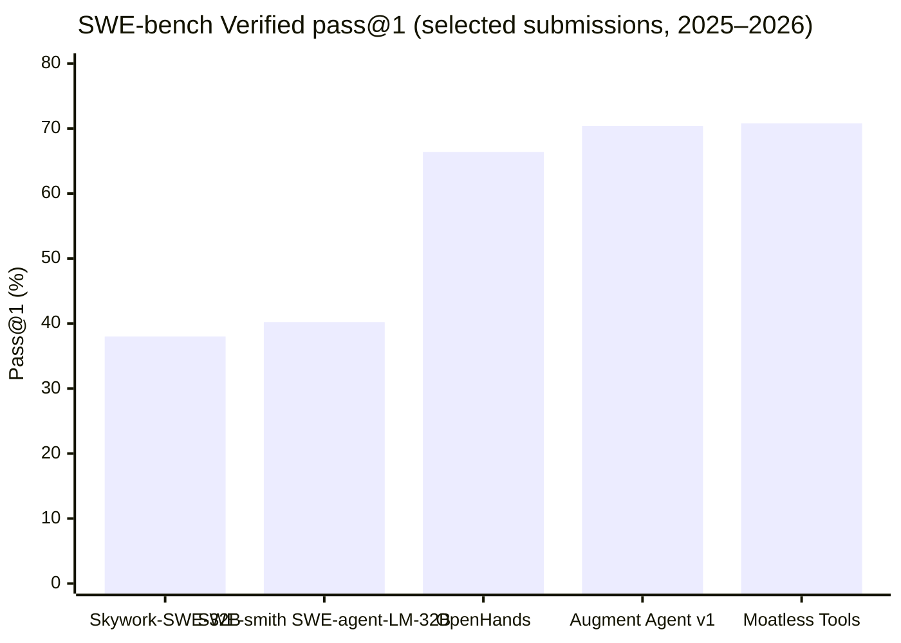
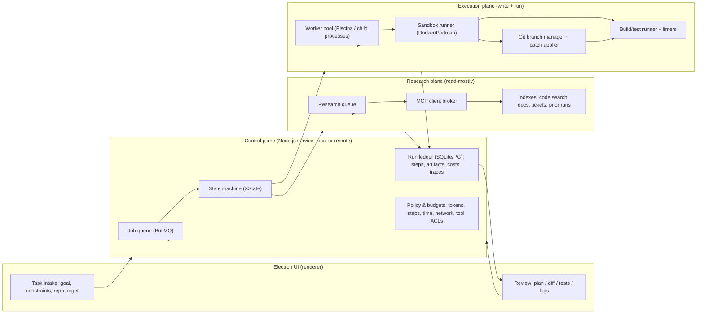
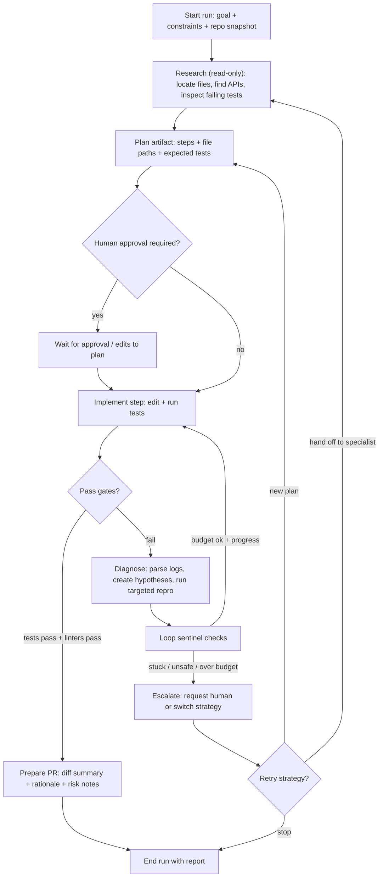

# AI Agent Landscape 2026 for a Node.js/Electron Multi‑Agent Coding System

## Executive summary

Between 2024 and March 18, 2026, autonomous coding agents moved from “can it fix a ticket at all?” prototypes into production workflows that routinely create merge‑ready pull requests and can run for long horizons with increasingly robust orchestration patterns. A single headline metric illustrating the step‑change is the progression on **SWE-bench Verified** (a human‑validated 500‑issue subset): multiple 2026 submissions report ~70%+ pass@1 resolution rates (e.g., Moatless Tools 70.8%, Augment 70.4%), while 2024-era systems like SWE-agent (with GPT‑4 Turbo) reported ~12.5% pass@1 on the original SWE-bench test set. citeturn43search3turn43search13turn43search18turn38view0turn37view0

The ecosystem converged on a few production “shapes”:

- **Asynchronous PR-producing agents in sandboxes** (cloud or containerized), with a harness that validates changes by running tests and producing artifacts. Cursor reports that >30% of its internally merged PRs are created by agents operating autonomously in cloud sandboxes. citeturn44view3  
- **Plan‑then‑execute loops** where agents first produce a structured plan referencing file paths and code context, then implement after approval; Cursor documents this as a best practice and treats plans as durable artifacts stored in-repo. citeturn44view2  
- **Debug loops driven by runtime signal**, not just static code reading; Cursor’s Debug Mode explicitly uses instrumentation/logs, hypothesis generation, and user‑verified reproduction/verification to fix classes of bugs that stump single-pass coding. citeturn44view1  
- **Simpler scaffolds as models improved**: mini-swe-agent explicitly argues that as models became more capable, heavy scaffolding became less necessary, favoring minimal control flow and sandbox-friendly command execution while achieving >74% on SWE-bench Verified (under its reported setup). citeturn9view0turn11search0  

For your Node.js/Electron target, the most defensible baseline as of **March 18, 2026** is to align with:
- **Node.js LTS v24 (“Krypton”)**, with “v24.14.0 Latest LTS” indicated in the official releases table. citeturn13view0  
- **Electron stable 41.0.3 (released Mar 18, 2026)**, which bundles **Node.js 24.14.0** (per Electron’s releases matrix). citeturn12search2turn12search6  

Because key constraints are unspecified (exact Node/Electron versions beyond “LTS”; concurrency/scale targets; cloud vs on‑prem; budget), recommendations below are framed as **decision points** with **explicit trade‑offs** rather than a single brittle architecture.

## Landscape map of autonomous coding agents

A practical “2024–2026 map” for autonomous coding splits into (a) commercial product systems that ship PRs and run sandboxes and (b) research/open platforms and agent scaffolds that heavily influence best practices and benchmarking.

### Teams, labs, and companies shaping 2024–2026

| Organization | Category | Notable 2024–2026 agentic coding system(s) | What they materially contributed to the landscape | Primary/official anchor |
|---|---|---|---|---|
| entity["company","Cognition AI","ai startup"] | Commercial | Devin | Popularized “autonomous AI software engineer” narrative; published SWE-bench performance claims (13.86% resolved on SWE-bench in initial announcement). citeturn14search0 | citeturn14search0 |
| entity["company","GitHub","software company"] (via entity["company","Microsoft","technology company"]) | Commercial | Copilot coding agent | Enterprise-integrated “asynchronous, autonomous developer agent” in GitHub workflows; announced at Build 2025 and later marked generally available for paid users. citeturn14search1turn14search4 | citeturn14search1turn14search4 |
| entity["company","Anthropic","ai company"] | Commercial + platform | Claude Code; MCP | Matured CLI-first coding agent tooling and a tool/data integration protocol (Model Context Protocol); positioned MCP as secure two‑way connector standard. citeturn15search2turn15search5turn15search1turn15search7 | citeturn15search2turn15search5 |
| entity["company","OpenAI","ai company"] | Platform + tooling | Responses API tools; Agents SDK; Swarm (educational) | Standardized agent building blocks (Responses API tools, Agents SDK) and clarified platform direction (Responses as “future direction”; Assistants API deprecation timeline). citeturn18search6turn18search9turn18search4turn18search0 | citeturn18search9turn18search4turn18search6 |
| entity["company","Replit","software company"] | Commercial | Replit Agent | “Idea → deployed app” agent workflow; public launch Sept 2024 and subsequent “agent-first” positioning. citeturn16search15turn16search5turn16search7 | citeturn16search15turn16search5 |
| entity["company","All Hands AI","ai company"] | Open + commercial | OpenHands (formerly OpenDevin) | Large open platform for software-dev agents (SDK + UI + cloud); SWE-bench Verified submissions in the mid-to-high 60% range under certain configs; heavy influence on open agent harness patterns. citeturn29view0turn45search1turn45search2turn45search0 | citeturn45search1turn29view0 |
| entity["organization","Princeton University","princeton, nj, us"] and entity["organization","Stanford University","stanford, ca, us"] (research teams) | Academic | SWE-bench; SWE-agent; mini-swe-agent; SWE-smith; SWE-ReX | Benchmarks + agent scaffolds + data scaling pipelines; drove evaluation norms and reproducible harnessing for SWE tasks. citeturn9view0turn43search3turn41search3turn42view0 | citeturn43search3turn41search3turn42view0 |

image_group{"layout":"carousel","aspect_ratio":"16:9","query":["Devin AI software engineer demo","GitHub Copilot coding agent screenshot","Claude Code CLI screenshot","Cursor cloud agents remote desktop","Replit Agent app builder interface","OpenHands OpenDevin web UI screenshot"],"num_per_query":1}

### What “state of the art” means in practice in 2026

A 2026 “SOTA” coding agent is less a single model prompt and more a **pipeline**:

- A **control plane** that queues work, enforces budgets, logs traces, and gates merges. This matches how leading vendor systems describe operation (agents produce PRs; systems keep artifacts and validate). citeturn44view3turn14search4  
- A **sandboxed execution plane** (container or cloud VM) that runs builds/tests and prevents uncontrolled shell and network behavior. Cursor explicitly discusses sandboxed commands and cloud sandboxes; OpenHands highlights Docker-based local GUI and cloud deployments. citeturn44view3turn45search5turn45search2  
- A **multi-phase loop**: plan → implement → test → diagnose → iterate, with explicit transitions to human confirmation on ambiguous steps (especially for debugging and behavior validation). citeturn44view2turn44view1  

## Frameworks, libraries, and protocol building blocks

This section focuses on what you can realistically compose in a Node.js/Electron orchestrator in 2026, while still locating those choices within the broader multi-agent ecosystem.

### Agent orchestration frameworks and exact versions

| Framework / package | Primary language | Version (as of Mar 18, 2026) | What it’s best for | Trade‑offs for a production Node/Electron orchestrator | Source |
|---|---|---:|---|---|---|
| OpenAI Agents SDK (`@openai/agents`) | TypeScript | 0.7.1 | Lightweight agent runner, multi-agent handoffs, tracing-oriented workflow primitives. citeturn19search0 | Tight alignment with OpenAI ecosystem; still requires you to design sandbox, merge gates, and org-specific policy enforcement. citeturn18search16turn19search0 | citeturn19search0turn18search16 |
| OpenAI Agents SDK (`openai-agents`) | Python | 0.12.4 | Reference implementation of Agents SDK concepts; useful for design transfer even if your runtime is Node. citeturn20view0 | Not Node-native; use as conceptual spec/behavioral reference rather than direct dependency. | citeturn20view0turn18search4 |
| LangChain.js (`langchain`) | TypeScript | 1.2.34 | Broad LLM app composition; connectors; tool abstractions. citeturn21search0 | Flexibility can become sprawl; for production you’ll want explicit state machines and artifact-based memory rather than purely chain-based composition. | citeturn21search0turn21search4 |
| LangGraph (`@langchain/langgraph`) | TypeScript | 1.2.2 | Stateful multi-actor workflows (“graphs”) with durable state transitions; closest off‑the‑shelf fit for multi-agent orchestration in JS. citeturn21search1 | Adds a workflow layer you must integrate with your own job queue + sandbox; still requires strong operational guardrails. | citeturn21search1turn21search19 |
| LlamaIndex.TS (`llamaindex`) | TypeScript | 0.12.1 | Data + retrieval frameworks (RAG), indexing, document pipelines. citeturn22search0 | Retrieval ≠ orchestration; best used behind a “research queue” / context service rather than the core agent loop. | citeturn22search0turn22search1 |
| Model Context Protocol SDK (`@modelcontextprotocol/sdk`) | TypeScript | 1.27.1 | Standardized tool/data connectors for agents (client/server pattern). citeturn24search3turn15search2 | Great for ecosystem interoperability; but you still need per-connector policy, auth, and data governance. | citeturn15search2turn24search3 |
| CrewAI (`crewai`) | Python | 1.10.1 | Role-playing “crew” patterns; quick multi-agent prototypes. citeturn24search0 | Not Node-native; more useful to study prompt/team patterns than for direct embedding in Electron. | citeturn24search0 |
| PydanticAI (`pydantic-ai`) | Python | 1.70.0 | Typed/validated structured interactions with LLMs; strong for enforcing schemas/guardrails. citeturn24search1 | Again not Node-native; but the “schema-first” discipline is highly transferable to a TS orchestrator. | citeturn24search1turn20view0 |

### Why MCP matters for your architecture

MCP is positioned by Anthropic as an **open standard** enabling “secure, two‑way connections” between data sources/tools and AI-powered tools, with a client/server architecture where developers expose data via MCP servers or build MCP clients that connect to servers. citeturn15search2 In practice, this is a strong fit for your requirement to maintain **research queues** and **tooling boundaries**:

- Put “read-mostly” context sources (code search, docs, tickets, run logs) behind MCP servers.  
- Treat your orchestrator (Electron/Node) as an MCP client that brokers access with policy gates, logging, and redaction.  
- Keep the “coding worker” sandbox on a minimized capability set (filesystem + test runner), while “research workers” can have controlled network access.

Cursor’s ecosystem signals MCP’s pull into IDE agent workflows (e.g., “MCP Apps” in Cursor changelog), and OpenAI’s Agents SDK now explicitly lists MCP as a tool type in its docs and package dependencies (e.g., `mcp` appears as a dependency in `openai-agents`). citeturn17search1turn20view0turn19search18  

## Benchmarks, leaders, and what the results really imply

### Benchmark landscape most relevant to autonomous coding agents

| Benchmark | Timeframe | What it measures | Why it matters for orchestrator design | Source |
|---|---|---|---|---|
| SWE-bench (original) | 2023→2026 mainline | Real GitHub issues with tests; evaluates patch correctness via repo tests | Forces full loop: locate files, edit, run tests, iterate; tends to reward strong tool/sandbox harness design as much as model quality | citeturn43search15turn43search13 |
| SWE-bench Verified | 2024→2026 | Human-validated subset of SWE-bench (500 samples) | Higher signal-to-noise for “actually correct fixes”; closer to production merge gating expectations | citeturn43search18turn29view0 |
| SWE-Bench+ | 2024 | Audit/filtered variant; highlights leakage + weak tests and shows score drops after filtering | A warning: passing a benchmark can reflect “solution leakage” or weak tests; orchestrators must guard against accidental leakage and require stronger validation in CI | citeturn43search0turn43search4 |
| HumanEvalFix | 2024→2026 usage | Bugfixing tasks derived from HumanEval-style problems | Good for fast inner-loop regression testing of “edit existing code” skill; less representative of repo-scale dependency/test realities | citeturn43search3turn41search2turn41search10 |
| CodeClash | 2025 | Goal-oriented, iterative software engineering tournaments across arenas | Stress-tests long-horizon repo maintenance and strategic iteration; shows that even strong models degrade repos over time and lose to expert humans, implying need for “repo hygiene” automation in orchestrators | citeturn41search0turn41search8 |

### Representative benchmark leaders and results (2024–2026)

The single most decision-relevant headline for a production orchestrator is not “which model is top,” but that **agent systems now routinely operate in the 60–70%+ regime on SWE-bench Verified under certain configurations**, which changes the ROI calculus for investing in robust orchestration rather than bespoke prompt tricks.

#### SWE-bench / SWE-bench Verified results (selected, cited)

| System / submission | Date | Benchmark | Reported result | Notes on harness / implications | Source |
|---|---:|---|---:|---|---|
| SWE-agent (GPT‑4 Turbo base) | 2024 | SWE-bench (original test set) | 12.5% pass@1; 87.7% on HumanEvalFix | Demonstrates the impact of agent-computer interfaces (ACI) and constrained action spaces; establishes “tool interface design” as a performance lever. citeturn43search3turn43search13 | citeturn43search3turn43search13 |
| Devin | Mar 12, 2024 | SWE-bench | 13.86% resolved (as reported) | Early commercial “autonomous engineer” claim; comparable magnitude to SWE-agent era but with proprietary system assumptions. citeturn14search0 | citeturn14search0 |
| OpenHands submission | Apr 15, 2025 | SWE-bench Verified | 66.4% (332/500) | Shows a mature platform agent; explicitly disabled browsing in this eval; used a reranking/critic approach and multiple runs for sampling. citeturn29view0 | citeturn29view0 |
| Moatless Tools submission | Jun 11, 2025 | SWE-bench Verified | 70.8% (354/500) | Highlights “unified Docker container” harness and tool specialization (added tool for creating/running scripts; improved grep). citeturn38view0 | citeturn38view0 |
| Augment Agent v1 submission | Jun 10, 2025 | SWE-bench Verified | 70.4% (reported) | Another ~70% class result; described as “basic tools like bash and file editing” and explicitly inspired by Anthropic’s agent design. citeturn37view0 | citeturn37view0 |
| Skywork-SWE-32B submission | Jun 16, 2025 | SWE-bench Verified | 38.0% (190/500) | Notable open-weight “agent model” result; describes data scaling and an automated SWE data collection pipeline. citeturn40view0 | citeturn40view0 |
| SWE-smith paper (SWE-agent‑LM‑32B) | Apr 30, 2025 | SWE-bench Verified | 40.2% pass@1 (open-source-model claim) | Important because it ties **data generation pipelines** (50k instances from 128 repos) to higher open-weight performance, shifting focus to dataset + harness engineering. citeturn41search3 | citeturn41search3 |

#### Benchmark comparison chart (SWE-bench Verified, selected)



The values in this chart are taken directly from the cited submissions/papers. citeturn40view0turn41search3turn29view0turn37view0turn38view0  

### How to interpret these results for production engineering

Three benchmark-driven implications are especially actionable:

1. **Tool/harness design is now first-class**. SWE-agent’s central claim is that the agent-computer interface meaningfully changes agent behavior and performance. Production orchestrators should treat tool design (edit primitives, search primitives, test execution, error feedback formatting) as part of core product engineering. citeturn43search3turn43search13  

2. **Passing tests ≠ correct fix** unless the benchmark/test suite is strong. SWE-Bench+ reports that a meaningful fraction of successful patches can involve solution leakage or weak tests, and shows large score drops after filtering. This is a direct warning for orchestrators that “CI green” is necessary but not sufficient—especially for security/privacy-sensitive code. citeturn43search0turn43search4  

3. **Long-horizon repo health remains a bottleneck**. CodeClash explicitly finds that models struggle with long-term codebase maintenance and that top models lose to expert humans in its tournaments, indicating that production orchestrators need automated “repo hygiene” measures (lint/format enforcement, dead-code checks, diff minimization, dependency discipline) to prevent gradual degradation across multi-week agent runs. citeturn41search0turn41search8  

## Production orchestrator design for Node.js/Electron

This section translates landscape + benchmark lessons into a Node/Electron architecture emphasizing your required primitives: **loop sentinels, worker pools, merge pipelines, and research queues**.

### Reference architecture



This separation mirrors what high-performing systems emphasize operationally: sandboxed execution, explicit planning artifacts, and workflow coordination (e.g., planners/workers, long-running coordination, PR artifact production). citeturn44view0turn44view2turn44view3  

### Agent lifecycle flow with loop sentinels



This flow intentionally incorporates production best practices described by Cursor: plan mode before coding; start-over-from-plan when misaligned; debug loops built around runtime information and human verification. citeturn44view2turn44view1  

### Implementation approaches and trade-offs

| Design axis | Option | Advantages | Costs / risks | When to choose |
|---|---|---|---|---|
| Orchestration core | LangGraph workflows (`@langchain/langgraph@1.2.2`) | Natural representation of multi-agent stateful graphs; integrates with LangChain tooling if you already use it. citeturn21search1 | Adds framework overhead; you still must implement sandbox, merge gates, and durable artifact storage. | If you want explicit state graphs without building your own engine. |
| Orchestration core | OpenAI Agents SDK (`@openai/agents@0.7.1`) | Lightweight primitives (runners, handoffs, guardrails, tracing) and aligns with “Responses API is the future direction” guidance. citeturn19search0turn18search9turn18search4 | Vendor ecosystem alignment; still requires external queueing/sandboxing. | If you standardize on OpenAI models/tooling and value tracing primitives. |
| Orchestration core | Custom state machine (XState) | Deterministic control, auditable transitions, easier safety gating, easier to enforce budgets across steps. (XState is widely used for orchestration logic.) citeturn27search7turn27search3 | More engineering; you must design tool schemas and agent prompting discipline. | If your requirements demand strict observability and policy control. |
| Job distribution | BullMQ + Redis (`bullmq@5.71.0`) | Mature job queue semantics; retries, backoff, concurrency controls; good for hybrid local/remote scaling. citeturn25search0turn25search4 | Requires Redis ops; careful design needed to avoid duplicated side effects on retries. | When you want scalable worker pools beyond a single machine. |
| Worker execution | Worker threads pool (`piscina@5.1.4`) | Efficient CPU-bound concurrency; stable pooling abstraction. citeturn25search2turn25search10 | Not sufficient for isolation; sandboxing still needed for untrusted code execution. | When you need local parallelism for parsing, indexing, diffing, testing orchestration. |
| Sandbox | Docker orchestration (`dockerode@4.0.9`) | Programmable container lifecycle; good fit for per-task ephemeral sandboxes. citeturn28search2 | Docker daemon dependency; increased attack surface; must restrict mounts/network. | Default for reproducible local sandboxes. |
| Git operations | `simple-git@3.33.0` | Simple wrapper around Git; good developer ergonomics. citeturn28search1 | **Supply-chain/security risk**: recent critical vulnerability advisories emphasize prompt patching (upgrade guidance indicates fixed versions ≥3.32.3). citeturn28search17turn28search13 | Use only with strong dependency management + rapid patching; consider shelling out to system git in hardened environments. |

### Concrete code patterns (TypeScript)

#### Pattern: queue → sandbox → merge pipeline with step budgets

```ts
// package pins (examples):
// bullmq@5.71.0, piscina@5.1.4, execa@9.6.1, pino@10.3.1

import { Queue, Worker, Job } from "bullmq";
import Piscina from "piscina";
import { execa } from "execa";
import pino from "pino";

type RunJob = {
  repoUrl: string;
  baseRef: string;          // commit SHA
  taskSpec: string;         // user goal + constraints
  budgets: { maxSteps: number; maxMinutes: number };
};

const log = pino();
const runQueue = new Queue<RunJob>("agent-runs", { connection: { host: "127.0.0.1", port: 6379 } });

const pool = new Piscina({
  filename: new URL("./workers/agentStepWorker.js", import.meta.url).href,
  maxThreads: Math.max(2, Math.floor(require("os").cpus().length / 2)),
});

function nowMs() { return Date.now(); }

async function runInSandbox(cmd: string, args: string[], cwd: string) {
  // In production, replace with Docker/Podman exec (or remote runner).
  const res = await execa(cmd, args, { cwd, timeout: 10 * 60_000, all: true });
  return { exitCode: res.exitCode ?? 0, output: res.all ?? "" };
}

async function mergeGateAndReport(workdir: string) {
  // Minimal example gates: lint/test. Add policy gates (security scans, formatting, etc.).
  const test = await runInSandbox("bash", ["-lc", "npm test"], workdir);
  if (test.exitCode !== 0) return { ok: false, stage: "test", log: test.output };

  const typecheck = await runInSandbox("bash", ["-lc", "npm run typecheck"], workdir);
  if (typecheck.exitCode !== 0) return { ok: false, stage: "typecheck", log: typecheck.output };

  return { ok: true, stage: "green", log: "All checks passed" };
}

new Worker<RunJob>(
  "agent-runs",
  async (job: Job<RunJob>) => {
    const start = nowMs();
    let steps = 0;

    // 1) Prepare workspace (clone, checkout baseRef, create branch).
    // 2) Run agent loop: plan -> implement -> test -> diagnose.
    // Here we model only the budget/sentinel wiring:
    while (steps < job.data.budgets.maxSteps) {
      const elapsedMin = (nowMs() - start) / 60_000;
      if (elapsedMin > job.data.budgets.maxMinutes) break;

      // Single "step" could be: fetch context, propose diff, apply patch, run tests.
      const stepResult = await pool.run({ /* structured step input */ });
      steps++;

      // Persist artifacts: prompts, patches, logs, test results, etc.
      log.info({ runId: job.id, steps }, "step complete");

      // Merge gates:
      const gate = await mergeGateAndReport("/path/to/workdir");
      if (gate.ok) return { status: "merged_candidate", steps };
      // Loop sentinel can use gate.stage + logs to decide strategy.
    }

    return { status: "stopped_by_budget", steps };
  },
  { connection: { host: "127.0.0.1", port: 6379 }, concurrency: 4 }
);
```

The package versions referenced above come from npm listings as of March 2026 (BullMQ 5.71.0; Piscina 5.1.4; Execa 9.6.1; Pino 10.3.1). citeturn25search0turn25search2turn28search0turn27search2  

#### Pattern: “plan as artifact” to reduce drift and enable restart

Cursor’s documented best practice is to generate a plan that the user can edit, then rerun from the plan if the agent drifts—often faster and cleaner than trying to salvage an in-progress run. It also describes storing plans as Markdown artifacts in `.cursor/plans/` to preserve context and enable resumption. citeturn44view2

In a Node/Electron orchestrator, the transferable pattern is: **every run writes a `PLAN.md` with links to the exact files/functions used**, and each execution step references the plan artifact (not accumulated chat history) as the durable “source of truth.”

## Pitfalls, failure modes, and mitigations

### Operational failure modes observed across 2024–2026 patterns

**Runaway loops / stagnation.** Cursor explicitly warns that long conversations accumulate noise and agents lose focus; their best practices recommend starting new conversations when the agent seems confused or repeats mistakes. citeturn44view2  
**Mitigation in your orchestrator:** implement loop sentinels based on (a) repeated tool calls with near-identical outputs, (b) repeated edits without improved test deltas, (c) “diff churn” (large changing diffs without stabilizing), and (d) elapsed time/tokens.

**Debugging without runtime signal.** Cursor’s Debug Mode is a direct acknowledgement that some bug classes consistently stump agents without structured reproduction, instrumentation, and validation loops. citeturn44view1  
**Mitigation:** bake a debug sub-loop into your lifecycle (instrument → reproduce → verify) and require runtime evidence in the “fix narrative” before allowing a merge candidate.

**False confidence from weak tests / benchmark leakage analogues.** SWE-Bench+ highlights that benchmark “successes” can reflect solution leakage or weak tests, with significant score drops after filtering. citeturn43search0turn43search4  
**Mitigation:** treat tests as one gate among several: add static analysis, targeted regression tests, and (for risky code) differential testing/fuzzing or human review triggers.

**Repo degradation over long horizons.** CodeClash finds models struggle with long-term codebase maintenance and that repos become progressively messy/redundant, with models losing to expert humans. citeturn41search0  
**Mitigation:** enforce “repo hygiene gates” (formatting, dead-code checks, dependency policy) and periodically run automatic refactor-minimization passes (“reduce diff size”, “remove redundant helpers”, “consolidate abstractions”).

**Supply-chain vulnerabilities in the orchestrator itself.** A recent critical advisory for `simple-git` illustrates that orchestration dependencies (especially those used in CI/automation) can become high-severity attack surfaces; guidance recommends upgrading to fixed versions (≥3.32.3). citeturn28search17turn28search13  
**Mitigation:** pin dependencies, monitor advisories, and isolate the orchestrator runtime (least privilege; avoid running with broad credentials).

### What is transferable vs project-specific

**Highly transferable (architectural invariants):**
- Explicit **workflow state** (plan/execute/validate) rather than free-form chat-driven loops. citeturn44view2turn44view1  
- Artifact-first design: **plans, diffs, test logs, traces** are durable and reviewable (Cursor and many SWE-bench submissions emphasize artifacts, logs, and reproducible harnesses). citeturn44view3turn38view0turn29view0  
- Strong sandboxing and harnessing (Docker-based local GUI and cloud sandboxes; submissions explicitly manage browsing/networking constraints). citeturn45search5turn29view0turn44view3  
- Schema/guardrail discipline (OpenAI Agents SDK describes guardrails and structured tool usage; the broader ecosystem increasingly treats validation as core). citeturn20view0turn18search11  

**Likely project-specific (depends on your org and codebase):**
- Exact agent roles (planner/coder/reviewer/tester) and escalation policies.
- Which tools are “built-in” vs delegated to MCP servers (depends on security boundaries and data residency).
- Merge policy strictness (CI coverage, security scans, code owner review rules).
- Latency/cost policy (token budgets, parallel run limits) which depends on budget and concurrency targets.

## Roadmap, version pinning guidance, and projections

### Prioritized implementation roadmap

**Foundation (first)**
- Fix your runtime baseline: Node.js **v24 LTS** and Electron **41.0.3** (or compatible stable) to align the embedded Node version and reduce ABI surprises. citeturn13view0turn12search6  
- Build the **run ledger** (SQLite initially is reasonable; Electron-friendly) capturing: run ID, repo hash, plan artifact path, step events, tool calls, patches, gate results, and costs.
- Implement **sandbox runner** (Docker/Podman) with: no secrets by default, network off by default, tight mounts, deterministic working directories.

**Core agent loop**
- Implement the **plan artifact** gate (Plan → Approve → Execute), explicitly modeled after proven practice (plan mode, editable plan, restart from plan if drift). citeturn44view2  
- Add **merge pipeline gates**: format/lint/typecheck/tests; store all logs as artifacts; fail closed.
- Add **loop sentinels**: step/time/token budgets + stagnation detectors.

**Scaling**
- Introduce **BullMQ** for distributed queuing and retries and a local **Piscina** pool for CPU-bound worker tasks (diffing, indexing, log parsing). citeturn25search0turn25search2  
- Split **research queue** from **coding queue**: research is read‑only, can use MCP and controlled network; coding is write+run inside sandbox with minimal network. This separation is consistent with MCP’s connector model and with how modern systems treat tool/data access boundaries. citeturn15search2turn24search3  

**Reliability hardening**
- Add **debug mode loop** (instrument → reproduce → verify) for bug classes that resist static fixes. citeturn44view1  
- Add security posture: dependency scanning for orchestrator packages, rapid patching policies, and “least privileges” for Git and CI tokens.

### Version pinning guidance (practical)

- Pin **Node/Electron** at majors and track security updates; Electron stable versions are released frequently, and the Electron release matrix clearly enumerates Chromium/Node versions per release. citeturn12search6turn12search3  
- Pin orchestration dependencies to **exact versions** in your lockfile and update on a controlled cadence:
  - `bullmq@5.71.0` citeturn25search0  
  - `piscina@5.1.4` citeturn25search2  
  - `execa@9.6.1` citeturn28search0  
  - `pino@10.3.1` citeturn27search2  
  - `dockerode@4.0.9` citeturn28search2  
  - `better-sqlite3@12.8.0` citeturn28search3  
- For Git automation tooling, treat supply-chain security as part of runtime correctness; recent advisories around `simple-git` recommend upgrading to fixed versions (≥3.32.3). citeturn28search17turn28search13  

### Projections for the next 12–24 months with confidence levels

| Projection (Mar 2026 → Mar 2028) | Confidence | Rationale (anchored in 2024–2026 signals) |
|---|---|---|
| “PR-producing agents in sandboxes” become the default UX for serious coding agents (async runs, artifacts, merge gates) | High | Cursor already reports >30% of internal merged PRs produced by cloud agents; Copilot coding agent positions itself as asynchronous/autonomous; OpenHands markets scaling to many agents. citeturn44view3turn14search4turn45search8 |
| MCP (or MCP-like) becomes a dominant interoperability layer for tool/data connectors across agent stacks | Medium-High | Anthropic introduced MCP explicitly as an open standard; MCP SDKs are actively versioned (e.g., TS SDK 1.27.1) and third-party tutorials and IDE tooling reference MCP integrations. citeturn15search2turn24search3turn17search1 |
| Benchmarks shift further toward “goal-oriented” and long-horizon maintenance evaluation (beyond patch-by-tests) | High | CodeClash explicitly targets goal-oriented software engineering and shows long-horizon repo maintenance weaknesses, creating pressure for more realistic evals. citeturn41search0turn41search8 |
| Reported benchmark scores keep rising, but production reliability gains require orchestration improvements (not only stronger models) | Medium | SWE-Bench+ shows benchmark fragility (leakage/weak tests), and CodeClash highlights maintenance limits; both imply that raw model gains alone won’t guarantee robust production outcomes. citeturn43search0turn41search0 |
| Open-weight “SWE specialist” models continue to narrow the gap on SWE-bench Verified via data scaling pipelines | Medium | SWE-smith and Skywork both frame improvements as data scaling/pipeline-driven and report ~38–40% Verified open-weight results, suggesting a viable trendline but not yet parity with top proprietary+system stacks. citeturn41search3turn40view0 |

### Platform/API direction that affects your build-vs-buy decisions

If you plan to depend on OpenAI’s platform primitives, OpenAI’s docs state that the **Responses API** represents the future direction for building agents, and that the Assistants API is deprecated with a stated sunset date (Aug 26, 2026). citeturn18search9 This matters operationally: build your provider layer so it can swap APIs/models without rewriting your orchestrator state machine, queues, or sandbox harness.

