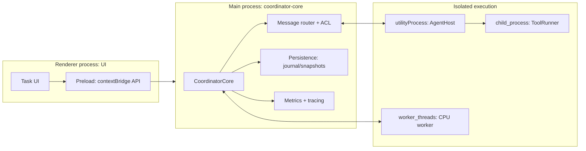
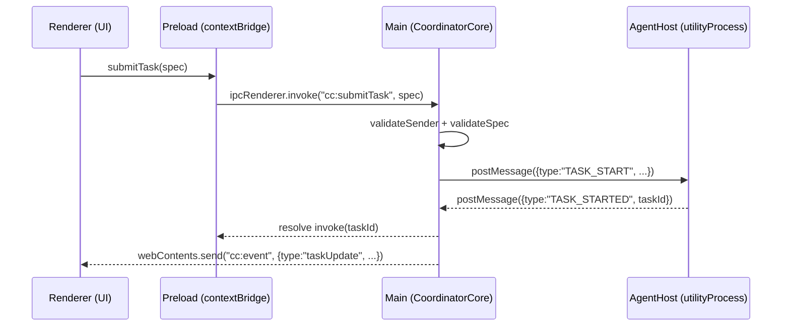

# Coordinator-core for a Node.js/Electron Multi-Agent Coding System

## Executive summary

“Coordinator-core” in a multi-agent coding desktop app is best treated as a **process-boundary-aware orchestration kernel**: it owns system-level scheduling, state, and security decisions, while pushing execution into **isolated workers/processes** (agents) and exposing a minimal, validated API surface to the UI. Electron’s model (main process + renderer processes + optional utility processes) strongly rewards this split, because the main process can remain a small, reliable control plane while compute- and risk-heavy work runs elsewhere. citeturn7search14turn2search35turn2search3

Version guidance (as of **March 17, 2026**, America/Chicago): Electron stable is **41.0.3**, and it ships with **Node.js 24.14.0** (plus Chromium 146). citeturn14view1 Electron’s official support policy is “latest three stable releases”, and Electron major releases follow an ~8-week cadence (aligned to Chromium). citeturn15view0turn14view0 For build tooling and CI (not the embedded Node inside Electron), prefer **Node.js 24 Active LTS** for stability. citeturn14view2

IPC and coordination guidance in one sentence: use **`ipcRenderer.invoke` ⇄ `ipcMain.handle`** for request/response (typed, validated, origin-checked), use **MessagePorts** for high-throughput or streaming channels, and use **`utilityProcess`** (or `child_process.fork`) to host agent runtimes that should be isolated from the main process. citeturn2search1turn10view1turn10view0turn2search35

## Assumptions and scope

Assumptions (explicit because your codebase details are unspecified):

Coordinator-core is intended to be a **reusable TypeScript module** that runs primarily in the **Electron main process**, owns orchestration state (tasks, agent registry, routing), and provides adapters for multiple transports (renderer IPC, worker threads, child/utility processes). citeturn2search35turn16search1

The system is “multi-agent” in the sense of multiple concurrent executors (LLM-backed agents, tool-running agents, code-indexing agents) that can be scheduled, cancelled, retried, and supervised. Electron applications embed Chromium + Node.js, so any renderer compromise can be much higher impact than a normal web app; coordinator-core must therefore treat the renderer as **untrusted by default**, even if you ship local content. citeturn7search14turn17view1

Cross-platform targets include Windows/macOS/Linux; where platform behavior diverges (code signing, process spawning, permissions), mitigations are called out. citeturn8search24turn8search0

## Coordinator-core responsibilities and interfaces

A coordinator-core that scales in complexity and remains secure usually separates responsibilities into four conceptual layers:

**Control plane (authoritative state + decisions).** Own task lifecycle (“queued → running → succeeded/failed/cancelled”), implement concurrency limits, backpressure, retries/backoff, timeouts, and cancellation semantics (including cleanup). This layer should be deterministic and testable without Electron. Electron specifically recommends keeping apps updated and adopting secure coding practices because vulnerabilities in Chromium/Node/Electron directly affect your shipped binary. citeturn17view1turn15view0

**Transport adapters (how messages move).** Provide a uniform interface over:
- Renderer ⇄ main IPC (invoke/handle, send/on, MessagePorts)
- Main ⇄ agent runtimes (utility processes, Node child processes, worker threads)
- Optional external IPC (native messaging, local sockets) citeturn2search1turn10view0turn13view0turn3search3

**Security boundary enforcement (who may ask for what).** In Electron, “all web frames can in theory send IPC messages,” so you should validate the sender of every IPC call. citeturn17view1turn16search3 Coordinator-core should provide a standard policy hook:
- allowed origins / allowed file-scheme replacements
- allowed operations per renderer “role”
- input validation + size limits
- explicit capability negotiation with agents

**Durability and reconciliation (what happens after a crash).** Electron apps can crash or processes can be killed; coordinator-core should expect agent restarts and UI reloads. Electron’s own guidance highlights that untrusted content is risky and that the main process is not a browser—so you need robust state reconstruction rather than “keep everything in memory forever.” citeturn17view1turn10view1

A concrete set of coordinator-core interfaces that tends to work well:

- `CoordinatorCore.start()` / `.stop()`: lifecycle managed from Electron main.
- `submitTask(taskSpec) -> taskId`: idempotent task creation (idempotency key).
- `subscribe(observer)`: event stream for UI + logs (push updates).
- `registerAgent(transport, metadata)` / `unregisterAgent(agentId)`.
- `send(agentId, command)` / `request(agentId, rpcCall) -> response`.
- `snapshot()` + `restore(snapshot|journal)`: durability.

The message model should use **plain data**, not class instances, because Electron IPC uses the HTML Structured Clone Algorithm (no prototypes), and Node worker_threads similarly clone according to the structured clone algorithm and do not preserve prototypes/accessors. citeturn10view2turn13view0turn3search0

## IPC and process architecture choices

Electron gives you multiple IPC/compute primitives, and coordinator-core should explicitly choose among them based on (a) performance needs, (b) isolation, and (c) serialization constraints.

### Process and execution primitives you should plan around

**Renderer ⇄ main IPC (`ipcRenderer` / `ipcMain`).** Prefer `ipcRenderer.invoke` with `ipcMain.handle`; Electron recommends `invoke` whenever possible and documents legacy approaches only for historical purposes. citeturn2search1turn11view1turn16search1

Serialization is via **Structured Clone Algorithm**; some types (DOM objects, Electron C++-backed objects like `BrowserWindow`/`WebContents`) are not serializable, and attempting to send prohibited types throws. citeturn10view2turn11view1turn3search0

**MessagePorts (high-throughput channels).** Electron supports MessagePorts and provides `MessagePortMain` / `MessageChannelMain` for the main process (which has no Blink integration). Only `postMessage` APIs can transfer ports (not `send` or `invoke`). Also, `MessagePortMain` queues messages until `start()` is called. citeturn10view1turn7search1turn7search8

**Worker threads (`node:worker_threads`).** Good for CPU-heavy operations; they can share memory via `ArrayBuffer` transfer or `SharedArrayBuffer`. Data is cloned via structured clone, and prototype/class info is not preserved; transferring `ArrayBuffer` can render other views unusable if they share the same backing buffer. citeturn10view3turn13view0turn13view3

**Node child processes (`node:child_process`).** `fork()` creates a Node process with an IPC channel; `subprocess.send()` supports flow control (returns `false` when backlog is too large) and can use “advanced” (structured-clone-like) serialization if opted in. However, output pipes have limited capacity; if a child writes too much to stdout/stderr without the parent consuming it, the child can block. Windows has special pitfalls like case-insensitive env vars and limitations on sending handles/sockets. citeturn11view0turn12view1turn12view0turn12view2

**Electron utility processes (`utilityProcess`).** Electron provides `utilityProcess.fork()` as an equivalent of Node’s `child_process.fork`, launched via Chromium Services API. It supports message ports and `child.postMessage(...)`. It also includes macOS-only hardening-related flags like `allowLoadingUnsignedLibraries` (and recommends leaving it disabled unless necessary). citeturn10view0turn2search35

**Cluster (`node:cluster`).** Cluster runs multiple Node processes sharing server ports; Node explicitly suggests using worker_threads instead when process isolation is not needed. In Electron desktop apps, cluster is typically only relevant if you host a local server and need multi-core request handling. citeturn4search0turn1search0

### IPC mechanisms comparison table

| Mechanism | Boundary | Serialization | Strengths | Common coordinator-core uses | Key pitfalls |
|---|---:|---|---|---|---|
| `ipcRenderer.invoke` ⇄ `ipcMain.handle` | renderer ⇄ main | Electron IPC structured clone citeturn10view2turn11view1 | Simple request/response; built-in Promise shape; recommended by Electron citeturn2search1 | UI calls into coordinator-core (submit task, query state, cancel task) | Sender validation required for every handler citeturn17view1; thrown Errors are not the same object cross-boundary citeturn11view1 |
| `webContents.send` / `ipcRenderer.on` | main → renderer (push) | structured clone citeturn11view1turn16search1 | Push events (task updates, logs) | Event stream from coordinator-core to UI | Do not expose raw `event` object to renderer; wrap callbacks citeturn11view1 |
| MessagePorts (renderer/main) | high-perf channel | structured clone + transferable ports citeturn10view1turn11view1 | Higher throughput; supports streaming patterns; can connect renderers directly | Log streaming, incremental task traces, high-frequency progress updates | Must use `postMessage` to transfer ports; main uses `MessagePortMain` + `start()` citeturn10view1 |
| `worker_threads` | same process, different thread | structured clone; transfer list; prototypes not preserved citeturn13view0turn10view3 | CPU-heavy work without spawning new processes; can share memory citeturn10view3 | Parsing/indexing, diffing, embeddings, compression | Transfer list misuse can break buffers citeturn13view3; still shares failure domain with Electron main if you misuse native addons |
| `child_process.fork` | full process | default JSON; optional advanced serialization based on structured clone citeturn12view2turn12view1 | Strong isolation; can restart independently | Running agent runtimes/tools; sandboxing untrusted plugins | Pipe buffering can block child if not drained citeturn11view0; Windows env casing and handle-sending limitations citeturn11view0turn12view1 |
| `utilityProcess.fork` | full process (Chromium services) | message ports + postMessage citeturn10view0 | Electron-supported process model; designed for crash-prone/untrusted services citeturn2search35turn10view0 | Primary “agent host” process for coordinator-core | Misusing macOS unsigned library loading can weaken security citeturn10view0 |

### Native messaging relevance

If your multi-agent system needs to interoperate with a browser extension (e.g., coordinate code actions between the desktop app and a browser-based UI), Chrome’s native messaging provides a length-prefixed JSON message protocol over stdio with a **1 MB max message size from the host to Chrome** and strict `allowed_origins` allowlisting. citeturn3search3turn3search11 Coordinator-core should treat this like an external, untrusted transport: add authentication, strict schema validation, and rate limits.

## Implementation patterns with concrete TypeScript examples

The patterns below aim to make coordinator-core: (a) safe across process boundaries, (b) resilient to crashes/restarts, and (c) observable and debuggable.

### Architecture and message flow diagrams



This process split aligns with Electron’s process model and the intended use of utility processes for “untrusted services, CPU intensive tasks, or crash prone components.” citeturn2search35turn10view0turn10view3



Electron recommends `invoke`/`handle` for two-way renderer-to-main patterns, and warns that IPC must validate senders because iframes/child windows may send messages. citeturn2search1turn17view1

### A versioned, schema-validated message envelope

Key goals:
- No class instances over IPC (structured clone drops prototypes) citeturn10view2turn13view0
- Explicit versioning for schema evolution (back/forward compatible decoding)
- Correlation IDs for tracing and retries

```ts
// coordinator-core/protocol/envelope.ts
export type UUID = string;

export type TraceContext = {
  traceId: string;
  spanId: string;
};

export type EnvelopeV1<TType extends string, TPayload> = {
  v: 1;
  id: UUID;           // unique message id (dedupe + tracing)
  type: TType;        // e.g. "TASK_START"
  ts: number;         // epoch ms
  replyTo?: UUID;     // correlation for request/response
  trace?: TraceContext;
  payload: TPayload;
};

// Example command payloads
export type TaskStart = EnvelopeV1<"TASK_START", {
  taskId: UUID;
  agentId: string;
  spec: {
    repoPath: string;
    goal: string;
    maxSteps: number;
  };
}>;

export type TaskEvent = EnvelopeV1<"TASK_EVENT", {
  taskId: UUID;
  level: "info" | "warn" | "error";
  message: string;
  step?: number;
}>;
```

Schema evolution rule of thumb: **never reuse `type` for a semantically incompatible payload**; instead bump `v` or introduce a new `type` so old components can reject safely.

If you adopt JSON-RPC-like semantics for request/response, the spec requires `jsonrpc: "2.0"` in each message and gives a standard structure for requests/responses/notifications. citeturn3search2turn3search1turn11view1

### IPC pattern: main ↔ renderer (secure invoke API + push events)

**Main process: register handlers with sender validation.** Electron explicitly recommends validating IPC senders (`senderFrame`) and using a real URL parser instead of naive string comparisons. citeturn17view1turn16search14turn16search4

```ts
// main/ipc/registerCoordinatorIpc.ts
import { ipcMain, WebFrameMain, BrowserWindow } from "electron";
import { URL } from "node:url";

function validateSender(frame: WebFrameMain | null): boolean {
  if (!frame) return false;
  // Beware about:blank and edge cases. frame.origin can differ from frame.url.
  // origin is serialized per RFC 6454, and can be "null" for some pages.
  // Prefer allowlisting known origins for your app protocol or https origin. citeturn16search4turn17view1
  try {
    const u = new URL(frame.url);
    return u.protocol === "app:" && u.host === "local";
  } catch {
    return false;
  }
}

export function registerCoordinatorIpc(coordinator: {
  submitTask: (spec: unknown) => Promise<{ taskId: string }>;
  cancelTask: (taskId: string) => Promise<void>;
}) {
  ipcMain.handle("cc:submitTask", async (e, spec) => {
    if (!validateSender(e.senderFrame)) return { taskId: "" };
    // validate spec with a schema (zod/ajv), enforce size limits, etc.
    return coordinator.submitTask(spec);
  });

  ipcMain.handle("cc:cancelTask", async (e, taskId: string) => {
    if (!validateSender(e.senderFrame)) return;
    await coordinator.cancelTask(taskId);
  });
}

export function pushCoordinatorEvent(win: BrowserWindow, event: unknown) {
  win.webContents.send("cc:event", event);
}
```

**Preload: expose a narrow API via contextBridge.** Electron’s contextBridge requires that exposed values be primitives/objects of primitives/functions; non-function values are copied and frozen, functions are proxied. citeturn2search0

Also note: `ipcRenderer` cannot be sent over the contextBridge as of newer Electron versions; you should wrap what you need rather than exposing raw modules. citeturn11view1

```ts
// preload/index.ts
import { contextBridge, ipcRenderer } from "electron";

contextBridge.exposeInMainWorld("coordinator", {
  submitTask: (spec: unknown) => ipcRenderer.invoke("cc:submitTask", spec),
  cancelTask: (taskId: string) => ipcRenderer.invoke("cc:cancelTask", taskId),

  // Push events (main -> renderer)
  onEvent: (handler: (ev: unknown) => void) => {
    // Electron warns: don't expose the raw event argument to renderer;
    // wrap it so renderer doesn't get access to dangerous objects. citeturn11view1
    const listener = (_event: unknown, payload: unknown) => handler(payload);
    ipcRenderer.on("cc:event", listener);
    return () => ipcRenderer.off("cc:event", listener);
  }
});
```

**Renderer: call the API.**

```ts
// renderer/submitTask.ts
declare global {
  interface Window {
    coordinator: {
      submitTask(spec: unknown): Promise<{ taskId: string }>;
      cancelTask(taskId: string): Promise<void>;
      onEvent(handler: (ev: unknown) => void): () => void;
    };
  }
}

export async function run() {
  const unsub = window.coordinator.onEvent(ev => console.log("event", ev));
  const { taskId } = await window.coordinator.submitTask({
    repoPath: "/path/to/repo",
    goal: "Implement feature X",
    maxSteps: 20
  });
  // ...
  unsub();
}
```

Avoid `ipcRenderer.sendSync`: Electron warns it blocks the whole renderer process until the reply is received, and should be “last resort.” citeturn11view1

### IPC pattern: main ↔ agent host (utilityProcess supervisor + routing)

Why utilityProcess: Electron positions it as a Node.js-enabled child process suitable for “untrusted services, CPU intensive tasks or crash prone components” and provides `postMessage` with optional transferable `MessagePortMain`s. citeturn2search35turn10view0

```ts
// main/agents/agentHost.ts
import { utilityProcess, MessageChannelMain } from "electron";
import path from "node:path";

type AgentHostHandle = {
  child: ReturnType<typeof utilityProcess.fork>;
  send: (msg: unknown) => void;
  dispose: () => void;
};

export function spawnAgentHost(): AgentHostHandle {
  const child = utilityProcess.fork(path.join(__dirname, "agentHostEntry.js"), [], {
    serviceName: "AgentHost",
    // Leave allowLoadingUnsignedLibraries disabled unless you have a compelling need. citeturn10view0
    allowLoadingUnsignedLibraries: false
  });

  child.on("message", (event: any) => {
    // event.data in utility processes depends on handler style; keep messages plain.
    console.log("agent host msg", event);
  });

  return {
    child,
    send: (msg) => child.postMessage(msg),
    dispose: () => child.kill()
  };
}
```

If you need a **stream of events** (e.g., token-by-token logs, incremental planner traces), use a MessagePort instead of flooding `postMessage` with tiny messages:

```ts
// main/agents/streamingPort.ts
import { MessageChannelMain } from "electron";

export function createStreamingPort(child: any) {
  const { port1, port2 } = new MessageChannelMain();
  // Send one end to the utility process
  child.postMessage({ type: "ATTACH_STREAM" }, [port2]);
  // Keep port1 in main; start receiving
  port1.on("message", (ev: any) => {
    // ev.data is the transmitted payload
    console.log("stream", ev.data);
  });
  port1.start();
  return port1;
}
```

This aligns with Electron’s MessagePorts guidance: main process uses `MessagePortMain`, must call `start()`, and ports can be transferred only via `postMessage` methods. citeturn10view1turn10view0

### Task queue, retries, backpressure, and timeouts

Coordinator-core needs **backpressure** at multiple levels:
- UI submissions (don’t enqueue infinite work)
- Agent mailbox size (don’t overload a process/thread)
- Tool subprocess output (avoid blocking on pipe buffers)

Node’s own stream docs define backpressure mechanics (e.g., `highWaterMark`, `write()` returning `false`, and resuming on `drain`). citeturn9search1turn9search5 For child-process IPC, Node explicitly supports flow control: `subprocess.send()` returns `false` when backlog exceeds a threshold. citeturn12view1

A practical coordinator queue skeleton:

```ts
// coordinator-core/scheduling/asyncQueue.ts
type TaskFn<T> = () => Promise<T>;

export class AsyncQueue {
  private running = 0;
  private readonly pending: Array<{
    fn: TaskFn<unknown>;
    resolve: (v: unknown) => void;
    reject: (e: unknown) => void;
  }> = [];

  constructor(
    private readonly concurrency: number,
    private readonly maxQueueSize: number
  ) {}

  size() { return this.pending.length; }

  enqueue<T>(fn: TaskFn<T>): Promise<T> {
    if (this.pending.length >= this.maxQueueSize) {
      return Promise.reject(new Error("Queue is full (backpressure)"));
    }
    return new Promise<T>((resolve, reject) => {
      this.pending.push({ fn, resolve, reject });
      this.pump();
    });
  }

  private pump() {
    while (this.running < this.concurrency && this.pending.length > 0) {
      const item = this.pending.shift()!;
      this.running++;
      item.fn()
        .then(item.resolve)
        .catch(item.reject)
        .finally(() => {
          this.running--;
          this.pump();
        });
    }
  }
}
```

Timeout wrapper (for RPC calls, tool runs, or agent steps):

```ts
export async function withTimeout<T>(
  p: Promise<T>,
  ms: number,
  label: string
): Promise<T> {
  let t: NodeJS.Timeout | undefined;
  const timeout = new Promise<T>((_, reject) => {
    t = setTimeout(() => reject(new Error(`Timeout: ${label} after ${ms}ms`)), ms);
  });
  try {
    return await Promise.race([p, timeout]);
  } finally {
    if (t) clearTimeout(t);
  }
}
```

For subprocess cancellation, Node supports passing an `AbortSignal` in child process options (`signal`), enabling consistent cancellation propagation if you standardize on AbortController internally. citeturn12view0

### Persistence and state reconciliation (crash-safe coordination)

Coordinator-core should assume:
- utility processes can crash or be killed
- renderer can reload
- app can restart after partial work

A simple, robust durability model is:
1) append-only **journal** of state transitions (task created, assigned, started, event, finished)
2) periodic **snapshot** (materialized state)
3) on startup: load snapshot + replay journal tail

This approach also enables **idempotency**: when a task start command is re-sent after a reconnect, an agent can dedupe by `(taskId, commandId)`.

When identifying processes for reconciliation, Electron’s `ProcessMetric` includes `pid` and `creationTime`; the docs note that `pid` can be reused after a process dies, so `(pid, creationTime)` is safer for uniqueness. citeturn9search31

### Health checks, metrics, and tracing hooks

**Health checks.** Implement:
- heartbeat: main ↔ agent on a MessagePort
- watchdog: if no heartbeat within N seconds, restart agent
- “degraded mode”: if agent restarts too frequently, stop scheduling new tasks

If you want to pause/safely checkpoint on sleep/resume, Electron’s `powerMonitor` emits `suspend` and `resume`. citeturn6search3 In practice, some environments have known reliability issues with suspend handling; treat power events as best-effort and always make your persistence crash-safe anyway. citeturn6search7

**Metrics.**
- Process-level CPU/memory: `app.getAppMetrics()` returns `ProcessMetric[]`. citeturn9search10turn9search31
- Event loop health: Node’s `perf_hooks.monitorEventLoopDelay()` provides an `IntervalHistogram` sampling event loop delay; and `eventLoopUtilization()` provides ELU. Long event loop delays are a strong signal your coordinator is doing too much synchronous work. citeturn19view0turn19view1

**Tracing and structured observability.**
- For lightweight internal instrumentation, Node’s `diagnostics_channel` is a stable API to publish data to named channels for diagnostics/observability. citeturn9search3
- For distributed tracing, OpenTelemetry’s JS context propagation is designed around a context manager (commonly AsyncLocalStorage-based in Node). citeturn4search2turn4search1

Electron also provides:
- crash reporting via `crashReporter` (uses Crashpad; upload protocol compatible with Breakpad’s in practice). citeturn4search3
- Chromium tracing capture via `contentTracing`, viewable in `chrome://tracing`. citeturn4search16

## Configuration and security hardening

### Version and upgrade strategy

Electron is supported only on the latest 3 stable release lines; future stable/EOL dates are tied to Chromium schedule and can shift. citeturn15view0turn14view0 This has a direct coordinator-core implication: your coordinator protocol and schema evolution plan must support rolling upgrades where UI/main/agent versions can briefly mismatch during development (and possibly in the wild if you do partial updates).

Node’s official releases page emphasizes production apps should use Active or Maintenance LTS, and shows Node 24 as Active LTS as of Feb 24, 2026. citeturn14view2 Node is also publicly evolving its release schedule (announced March 2026) which affects longer-term upgrade planning. citeturn0search0

### BrowserWindow and preload security defaults

Electron security guidance is unambiguous: loading arbitrary untrusted content is a severe risk; keep Electron current; disable nodeIntegration; enable contextIsolation; validate IPC senders; avoid `file://`; limit creation of new windows; implement permission handlers where needed. citeturn17view1turn0search2turn0search13

A hardened BrowserWindow baseline:

```ts
// main/window/createMainWindow.ts
import { BrowserWindow } from "electron";
import path from "node:path";

export function createMainWindow() {
  const win = new BrowserWindow({
    width: 1200,
    height: 800,
    webPreferences: {
      preload: path.join(__dirname, "preload.js"),
      contextIsolation: true,      // default true since Electron 12 citeturn0search13
      nodeIntegration: false,
      sandbox: true,              // sandbox limits renderer capabilities citeturn2search15turn1search6
      webSecurity: true
    }
  });

  return win;
}
```

Note: Electron’s sandboxing doc states sandboxing is disabled whenever nodeIntegration is enabled; so treat `nodeIntegration: false` as a prerequisite for meaningful sandboxing. citeturn1search6turn2search15

### Remote module and security footguns

Electron’s built-in `remote` module was deprecated in Electron 12 and removed in Electron 14, reflecting security concerns; avoid building coordinator-core APIs that implicitly recreate `remote`-like capabilities. citeturn8search2turn8search3

### Navigation, new windows, permissions, and custom protocols

Coordinator-core should also “own” these platform security policy hooks (so teams don’t re-implement them inconsistently):

- **Navigation allowlisting:** electron security docs recommend blocking unexpected navigations and using Node’s URL parser because naive prefix checks can be fooled. citeturn17view1
- **Window creation controls:** use `webContents.setWindowOpenHandler()` to deny or constrain renderer-created windows; Electron documents renderer-created windows and the handler’s precedence. citeturn17view0turn17view1
- **Permission handlers:** Electron `session` docs state you must implement both `setPermissionRequestHandler` and `setPermissionCheckHandler` for complete permission handling. citeturn5search0
- **Avoid `file://`:** Electron security docs warn `file://` pages have broad file access; prefer custom protocols to better control what loads. citeturn17view1
- **Privileged schemes:** `protocol.registerSchemesAsPrivileged` must be called before `app` is ready and can be called only once. citeturn5search2turn5search14

### Packaging and signing (electron-builder)

Electron recommends code signing so users don’t hit OS security warnings; unsigned apps are blocked or require manual bypass steps. citeturn8search24

electron-builder configuration is commonly defined under `build` in `package.json`. citeturn1search19turn8search1 Its Windows code signing doc notes Windows is typically dual-signed (SHA1 & SHA256) and outlines certificate types. citeturn8search0 For macOS, electron-builder’s MacConfiguration docs emphasize entitlements configuration and warn that missing entitlements can cause crashes (e.g., `com.apple.security.cs.allow-jit` on some arm64 + Electron combinations). citeturn1search7

Example skeleton:

```json
{
  "name": "multi-agent-app",
  "version": "0.1.0",
  "main": "dist/main/index.js",
  "scripts": {
    "dev": "electron .",
    "build": "tsc -b",
    "dist": "electron-builder"
  },
  "devDependencies": {
    "electron": "^41.0.3",
    "electron-builder": "^26.0.0",
    "typescript": "^5.7.0"
  },
  "build": {
    "appId": "com.example.multiagent",
    "files": [
      "dist/**"
    ],
    "mac": {
      "hardenedRuntime": true,
      "entitlements": "build/entitlements.mac.plist",
      "entitlementsInherit": "build/entitlements.mac.inherit.plist"
    },
    "win": {
      "target": ["nsis"]
    }
  }
}
```

## Pitfalls, gotchas, and mitigation strategies

This section focuses on failure modes that show up specifically in coordinator-core: concurrency + IPC + security boundaries.

**Blocking the event loop (UI freezes and “everything is slow”).**
- `ipcRenderer.sendSync` blocks the renderer; Electron warns to use it only as a last resort. Mitigation: use `invoke`/`handle` and stream updates asynchronously. citeturn11view1turn2search1
- Node’s `child_process.execSync()` / `spawnSync()` blocks the event loop; Node warns synchronous methods can significantly impact performance by stalling the event loop. Mitigation: never run sync child-process calls in coordinator-core; move to utilityProcess / worker thread. citeturn11view0turn19view1

**Serialization surprises and schema drift.**
- Electron IPC uses structured clone; DOM objects and Electron objects (e.g., `WebContents`, `BrowserWindow`) are not serializable, and some Node objects aren’t either. Mitigation: only pass plain JSON-like objects or structured-clone-supported types. citeturn10view2turn11view1turn3search0
- Node worker_threads clone using structured clone; prototypes/accessors/classes are not preserved; Buffers may arrive as plain `Uint8Array`. Mitigation: treat IPC payloads as DTOs; reconstruct richer objects on each side if needed. citeturn13view0turn3search16
- Node child process IPC defaults to JSON serialization; advanced serialization must be opted in and isn’t a full superset of JSON (e.g., properties on built-in types may not carry over). Mitigation: pick one serialization mode per transport, document it, and enforce message schemas at boundaries. citeturn12view2turn12view1

**Error propagation that loses fidelity.**
- Electron notes that if the main handler throws, `invoke()` rejects, but the Error object in the renderer is not the same as the one thrown in the main process. Mitigation: define a `SerializableError` shape and map errors explicitly at boundaries. citeturn11view1

**IPC sender/origin validation gaps (security-critical).**
- Electron warns that iframes/child windows can send IPC; security docs show validating `senderFrame` and allowlisting hosts with a URL parser. Mitigation: coordinator-core should provide a standard `validateSender()` function and require it for every handler registration. citeturn17view1turn16search14turn16search3
- `senderFrame.url` and `senderFrame` can be null/empty under some conditions (e.g., navigation/destroyed frames, and documented edge cases). Mitigation: handle `null`/parse failures as deny-by-default; prefer allowlisting an `app://` custom protocol you control rather than relying on `file://` or fragile URLs. citeturn16search14turn16search7turn17view1

**Backpressure and queue overload.**
- Node child process `subprocess.send()` returns `false` when message backlog exceeds a threshold; this is an explicit flow-control signal. Mitigation: treat `false` as “stop sending; retry later”; implement mailbox size caps and per-agent concurrency. citeturn12view1
- If your agent host spawns tool subprocesses and you don’t drain stdout/stderr, the child can block due to limited pipe capacity. Mitigation: always consume or redirect stdio (pipe + drain, or ignore) depending on needs. citeturn11view0

**Electron WebRequest hook gotcha.**
- Electron’s `webRequest` docs warn that only the last attached listener will be used for certain events. Mitigation: coordinator-core should centralize network policy and compose decisions in one handler, rather than letting multiple features attach separate listeners. citeturn5search5

**Single-instance “leader election” quirks.**
- Electron’s `app` docs describe `second-instance` and note macOS enforces single instance for Finder launches but not necessarily for CLI launches, so you must use `requestSingleInstanceLock()` as needed. Mitigation: encode leadership as: “lock holder is coordinator leader,” and treat all other instances as clients that forward intents. citeturn7search0
- Known edge cases include behavior across user sessions or collisions based on app identity/name; these appear in Electron issue reports. Mitigation: test multi-user and “two versions installed” scenarios early; if you truly need multiple instances, implement explicit instance IDs and independent storage partitions. citeturn6search4turn7search15

**Power events are not a reliable checkpoint trigger.**
- Electron provides `powerMonitor` suspend/resume events, but there are reports of platform-specific reliability issues. Mitigation: use power events only to *attempt* graceful shutdown/checkpoint; rely on journaling for correctness. citeturn6search3turn6search7

## Primary references and exemplar open-source projects

Primary/official references used throughout:

- Electron process model and utility processes: citeturn2search35turn10view0  
- Electron IPC + serialization + MessagePorts: citeturn2search1turn10view2turn10view1turn11view1  
- Electron security guide (sender validation, navigation/window restrictions, file:// guidance): citeturn17view1turn0search2  
- Electron session permission handlers: citeturn5search0  
- Electron protocol privileges: citeturn5search2  
- Electron crashReporter and contentTracing: citeturn4search3turn4search16  
- Electron code signing: citeturn8search24  
- Electron release cadence & support policy: citeturn15view0turn14view0turn14view1  

Node.js primary references:

- Node `worker_threads` (structured clone, CPU focus, transfers): citeturn10view3turn13view0turn13view3  
- Node `child_process` (fork IPC, flow control, advanced serialization, pipe blocking, Windows env caveats): citeturn11view0turn12view1turn12view2  
- Node `cluster`: citeturn4search0  
- Node AsyncLocalStorage / async context: citeturn4search1  
- Node diagnostics_channel: citeturn9search3  
- Node perf_hooks (event loop delay + ELU): citeturn19view0turn19view1  
- Node streams/backpressure guidance: citeturn9search1turn9search5  
- Node release/support status (LTS): citeturn14view2  

Web standards / RFCs relevant for coordinator-core protocols:

- WHATWG structured clone / structured data: citeturn3search0  
- RFC 8259 (JSON): citeturn3search1  
- JSON-RPC 2.0 spec: citeturn3search2  

Exemplar open-source architecture to study (particularly relevant to “multi-agent” / plugin-host / isolation):

- The Visual Studio Code team’s migration to process sandboxing: discusses moving the extension host to a utility process and using message ports for direct communication. citeturn6search5  
- VS Code source organization wiki: notes extensions run in a separate “extension host” process. citeturn6search13  
- VS Code documentation on extensibility approach: highlights using separate processes communicating via stdin/stdout with JSON payloads (a strong precedent for agent/tool subprocess protocols). citeturn6search17