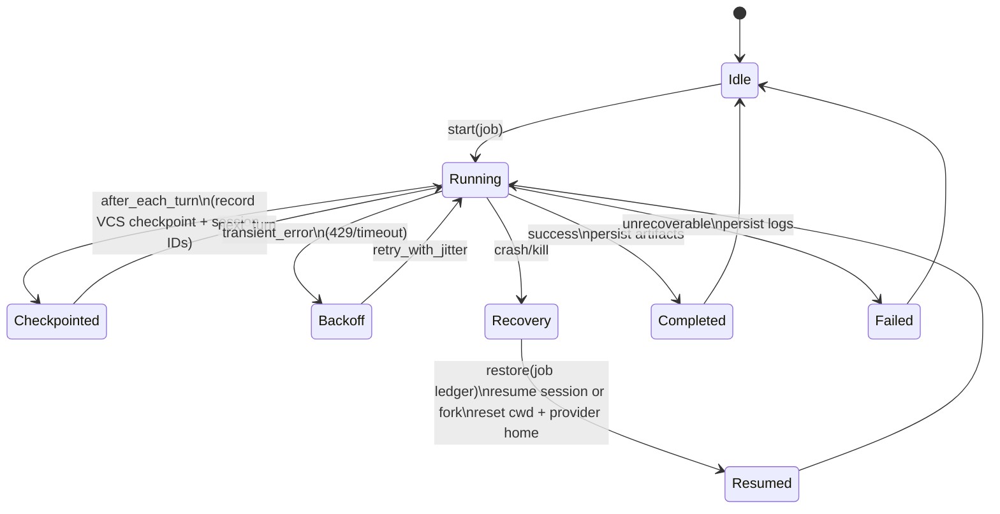

# Dual-Provider Runtime 2026 for Node.js and Electron Multi-Agent Coding Systems

## Executive summary

A “dual-provider runtime” that runs **Claude Code** and **Codex CLI** as durable, autonomous workers is best designed (in 2026) as an **event-streaming, session-aware, least-privilege orchestration layer** that treats each agent run as a recoverable transaction: (1) load or create a session, (2) run within bounded permissions/sandbox, (3) emit machine-readable events continuously, (4) checkpoint filesystem and agent state, and (5) restart/resume safely after failure. This aligns with how both CLIs are documented to operate in non-interactive automation: **Claude Code** supports print/headless mode (`-p`) with structured output (`json`) or newline-delimited streaming (`stream-json`) and optional JSON Schema validation. citeturn4search2turn5view0turn5view2 **Codex CLI** supports `codex exec` for CI/scripts, where progress streams on `stderr` and the final message on `stdout` by default, or emits a **JSONL event stream** (`--json`) with explicit event types and sample payloads, plus schema validation for the final output (`--output-schema`). citeturn21view0turn3view2turn3view5

Operationally, the two biggest “gotchas” that drive architectural requirements are:  
1) **session restore depends on stable identity anchors** (especially *working directory semantics*), and  
2) **safety controls can stall or silently broaden** if you don’t pin policies and handle approvals deterministically. Claude Agent SDK documentation states sessions live under an encoded working directory path and warns that resuming from a different `cwd` commonly yields a fresh session instead of history. citeturn16view2 Codex non-interactive mode provides `resume` flows (`codex exec resume`) and `--last` selection semantics that also depend on directory scoping, with an `--all` option when selecting across directories. citeturn3view2turn3view3

The state of the art therefore looks like:  
- **Prefer streaming event output** (`claude … --output-format stream-json`, `codex exec --json`) and parse it as NDJSON/JSONL, not as human-formatted text. citeturn4search2turn5view0turn21view0  
- **Persist a “run ledger”** containing: CLI version, model selection/version pinning, sandbox/permission mode, `cwd`, provider home directories (`CLAUDE_CONFIG_DIR`, `CODEX_HOME`), and captured session/thread IDs—so a crash can rehydrate deterministically. citeturn16view0turn13view0turn18search1turn21view0  
- **Use least privilege by default** (Claude “Plan Mode” / restricted tools; Codex read-only sandbox) and elevate only per-task, ideally with allowlists and policy-as-code. citeturn11view2turn5view5turn21view0turn3view5turn3view2  
- **Checkpoint aggressively**: use Claude’s built-in checkpointing for agent-made edits (with limitations) and/or your own VCS/worktree strategy for provider-agnostic rollback. citeturn11view1turn6search11turn19view0turn17search7  
- **Instrument everything** with OpenTelemetry where feasible; both toolchains support OTel in 2026, but with different knobs and defaults (Claude Code uses `CLAUDE_CODE_ENABLE_TELEMETRY` and OTEL exporter env vars; Codex uses an `[otel]` config block with prompts redacted by default). citeturn21view2turn20search7turn19view3

## Scope and assumptions

This report addresses operational requirements and invocation patterns in **2026** for running **Claude Code** and **Codex CLI** inside a Node.js/Electron multi-agent system, focusing on persistent autonomous loops and non-interactive worker processes. Node.js runtime version and Electron version are **unspecified** (per request), so all code patterns use broadly available Node primitives (spawned subprocesses, stream parsing, and message-passing). No Electron-version-specific APIs are assumed.

The term **“dual-provider-runtime-2026”** does not appear to correspond to a single public specification; here it is treated as an architectural goal: a runtime that can invoke and supervise both CLIs consistently, unify their event streams, persistence, safety posture, and restart semantics, and expose them as interchangeable “providers” to a multi-agent system.

## State of the art in 2026 for CLI-driven autonomous loops

The 2026 best-practice baseline is that both CLIs are **agentic runtimes**, not simple “one-shot completions,” which implies that automation must treat them as producing a *trajectory* (turns, tool calls, edits, plans) rather than only a final answer.

**Streaming vs batch prompt delivery and outputs are now first-class “automation surfaces.”** For Claude Code automation, `--output-format` explicitly includes `json` and `stream-json` (newline-delimited JSON) and supports JSON Schema validation via `--json-schema`. citeturn4search2turn5view0turn5view2 For Codex automation, `codex exec` defaults to “human-ish” output where progress goes to `stderr` and only the final agent message hits `stdout`, but `--json` switches `stdout` to a JSONL event stream with defined event types and sample payloads including `thread.started` with a `thread_id`. citeturn21view0turn3view2turn3view5

**Session persistence is fundamental and must be treated as a contract.** Claude’s SDK documentation specifies that sessions are stored under `~/.claude/projects/<encoded-cwd>/*.jsonl` and that mismatched working directories are the most common reason `resume` returns a fresh session. citeturn16view2 That single detail drives practical orchestration decisions: *your scheduler, worker processes, and any restoring code must preserve the exact `cwd` mapping* (or intentionally avoid resume and ship a summary). citeturn16view2 Codex similarly emphasizes session continuation flows for non-interactive mode (`codex exec resume …`) and exposes selection semantics (`--last`, `--all`) that are directory-aware. citeturn3view2turn3view3turn21view0

**Safety controls are increasingly policy-driven rather than “prompt-driven.”** Claude Code’s permission modes and rule syntax allow fine-grained allow/ask/deny rules, plus managed-only settings that can disable bypass mode and enforce managed permission rules/domains only. citeturn11view2turn12view5 Codex uses a two-layer model of sandbox mode + approval policy and notes that the agent runs with network access off by default; “full-auto” is a preset and “danger-full-access” is explicitly reserved for controlled environments. citeturn8view5turn3view5turn21view0turn3view2

**Observability is no longer optional for long-running autonomy.** Claude Code’s official Monitoring documentation provides a telemetry quickstart via OpenTelemetry environment variables (metrics and logs export), and the env var reference explicitly gates telemetry behind `CLAUDE_CODE_ENABLE_TELEMETRY=1`. citeturn21view2turn20search7 Codex security documentation describes opt-in OpenTelemetry export with telemetry off by default; it lists representative event categories and emphasizes prompt redaction unless explicitly enabled. citeturn19view3

## Operational requirements and controls by provider

### Claude Code operational requirements

**Installation and versioning.** As of March 17, 2026, the npm-distributed CLI package `@anthropic-ai/claude-code` shows a latest version of **2.1.78**, and the official changelog page is generated from GitHub and reflects the same version/date. citeturn9search1turn9search2 This supports a core runtime best practice: *pin CLI versions in production automation and record them in run metadata* (especially when relying on resume semantics and structured output contracts). citeturn9search2turn5view2turn16view1

**Prompt delivery and output modes.** In print/headless mode (`--print`, `-p`), Claude supports:
- output formats `text`, `json`, `stream-json`, and
- a streaming JSON mode (`stream-json`) suitable for real-time parsing, with optional inclusion of partial streaming events (`--include-partial-messages`) when used with `--print` and `--output-format=stream-json`. citeturn5view0turn5view2  
The headless documentation explicitly recommends `--output-format json` and `--output-format stream-json` for structured and streaming automation use cases, and supports schema-constrained output via `--json-schema`. citeturn4search2turn5view0

**Model selection and version pinning.** Claude model configuration explicitly warns that *aliases always point to the latest version* and recommends using full model names to pin. It provides an ordered precedence of `/model`, `--model`, `ANTHROPIC_MODEL`, and settings `model`, and includes enterprise restrictions (`availableModels`). citeturn16view1turn13view0turn5view1 For third-party deployments (including entity["company","Amazon","cloud provider"] Bedrock, entity["company","Google","cloud provider"] Vertex AI, and entity["company","Microsoft","cloud provider"] Foundry), it specifically advises pinning family-default environment variables (`ANTHROPIC_DEFAULT_*_MODEL`) to version-specific IDs to avoid silent breaks when aliases advance. citeturn16view1turn16view0

**Session persistence, resume/fork semantics, and state location.** Claude Code supports resuming the most recent conversation in the current directory (`--continue`) and resuming a specific session by ID/name (`--resume`), and for scripts it recommends composing resume with print mode (e.g., `claude --continue --print "prompt"`). citeturn6search4turn5view3turn5view2 Session storage is explicitly encoded by working directory under `~/.claude/projects/<encoded-cwd>/*.jsonl`, and mismatched `cwd` is called out as a common resume failure mode. citeturn16view2turn13view0 Claude also supports **forking** a resumed session (creating a new session ID) via `--fork-session` at the CLI layer and “fork_session” semantics at the SDK layer, which is foundational for safe experimentation and retry strategies after partial failure. citeturn5view3turn16view2

**Checkpointing and restart safety.** Claude Code checkpointing automatically captures state before edits, persists across resumed sessions, and is cleaned up with sessions after a default retention window (30 days, configurable). citeturn11view1turn13view0 Checkpointing has explicit limitations: changes made via Bash commands are not tracked by the checkpoint system (also echoed in the Agent SDK checkpointing reference that only edits through file tools are tracked). citeturn11view1turn6search11turn16view3 This matters for restart semantics: if your autonomous loop executes shell commands that mutate files, your runtime must supply its own robust rollback mechanism (typically git/worktree checkpoints). citeturn11view1turn19view0

**Safety flags, sandboxing, and tool restriction.** Claude exposes:
- permission modes (`default`, `acceptEdits`, `plan`, `dontAsk`, `bypassPermissions`) and a formal allow/ask/deny rule system with tool specifiers and wildcards, evaluated deny → ask → allow. citeturn11view2turn5view5  
- CLI flags to control tool availability: `--tools` (restrict tool set), `--allowedTools`, and `--disallowedTools`, plus `--permission-mode`. citeturn5view8turn5view5turn5view0turn11view2  
- a high-risk bypass flag `--dangerously-skip-permissions`, which administrators can disable via managed settings (`disableBypassPermissionsMode`). citeturn5view10turn11view2  
Claude also supports OS-level bash sandbox configuration via settings (filesystem and network allowlists, proxies, and managed-only “allow managed domains/paths only” governance). citeturn12view5turn11view2

**Authentication and secrets.** Claude Code supports `ANTHROPIC_API_KEY` and related auth env vars; importantly, it documents that when `ANTHROPIC_API_KEY` is set, **non-interactive mode (`-p`) always uses the key** (even if logged in with a subscription), and interactive mode requires approving the override. citeturn16view0 This drives a best practice for dual-provider runtimes: worker processes should run with a **minimal, explicit env** and not inherit broad user shell env by default, to avoid accidental credential routing and/or secret exposure. citeturn16view0turn11view2

**Observability.** Claude Code’s official monitoring docs specify how to enable OTel exports via environment variables (metrics and logs exporters, OTLP endpoints, intervals) and recommend managed configuration for org-wide rollout. citeturn21view2 The env var reference explicitly calls out `CLAUDE_CODE_ENABLE_TELEMETRY` as required before configuring OTel exporters. citeturn20search7

### Codex CLI operational requirements

**Installation and versioning.** As of March 16–18, 2026, the npm package `@openai/codex` shows version **0.115.0**, matching the GitHub releases page listing 0.115.0 as “Latest.” citeturn10search0turn10search4 For runtime auditability, record both the CLI and any SDK package versions used for integration (e.g., `@openai/codex-sdk` also shows 0.115.0). citeturn10search3turn10search0

**Prompt delivery and output modes.** Codex’s non-interactive mode (`codex exec`) is explicitly designed for CI/scripts. By default it streams progress to `stderr` and prints only the final agent message to `stdout`; for machine parsing you enable `--json` which makes `stdout` a JSONL stream, with documented event types and sample JSON lines showing `thread.started` with `thread_id`, item lifecycle events, and `turn.completed` usage payloads. citeturn21view0turn3view2turn3view5 If you want only the final message in a deterministic file output for downstream tools, `--output-last-message` writes it to disk. citeturn3view2turn3view3turn21view0 Codex also supports `--output-schema` with JSON Schema for final output validation, a direct analog to Claude’s `--json-schema` patterns. citeturn3view2turn21view0

**Model selection and provider routing.** Codex supports `--model` (`-m`) to override the configured model for a run, and supports profiles (`--profile`) defined in config. citeturn3view2turn3view5 Codex also documents an `--oss` flag to route to a local open source provider (requires a running Ollama instance), which is operationally relevant if your “dual-provider runtime” includes offline fallback or on-device lanes. citeturn3view2

**State location and persistence.** Codex stores local state under `CODEX_HOME` (default `~/.codex`) and documents common files including `config.toml`, `auth.json` (or OS keyring), and an optional `history.jsonl`, plus logs and caches. citeturn18search1turn4search11turn8view3 Non-interactive mode provides an `--ephemeral` flag specifically when you do **not** want to persist session rollout files to disk. citeturn21view0turn3view2 For resume semantics, Codex exec provides `codex exec resume` (by explicit session ID) and `--last` (most recent session scoped to current working directory), plus `--all` to consider sessions from any directory. citeturn21view0turn3view2turn3view3

**Safety model: sandbox + approvals + network defaults.** Codex security guidance states that network is off by default, and local operation uses an OS-enforced sandbox (typically the current workspace) plus an approval policy that controls when it must stop and ask before acting. citeturn8view5turn4search1 In CLI flags this maps to:
- `--sandbox` with explicit modes `read-only`, `workspace-write`, `danger-full-access`, and  
- `--ask-for-approval` modes `untrusted`, `on-request`, `never`, with explicit guidance that `never` is appropriate for non-interactive runs (and that older `on-failure` behavior is deprecated). citeturn3view5turn3view2  
Codex also includes an explicitly dangerous escape hatch (`--dangerously-bypass-approvals-and-sandbox`, `--yolo`). citeturn3view5turn19view1

**Authentication and credential storage.** Codex caches login details locally either in `~/.codex/auth.json` (plaintext) or the OS credential store; the docs explicitly warn to treat `auth.json` like a password. citeturn8view3turn8view4 Credential storage is configurable (`cli_auth_credentials_store = "file" | "keyring" | "auto"`), and managed environments can restrict login methods. citeturn8view3turn18search25 For CI automation, Codex non-interactive mode documents a recommended approach: provide credentials explicitly via `CODEX_API_KEY` (supported only in `codex exec`). citeturn21view0 It also documents an advanced trusted-runner workflow for ChatGPT-managed auth where `auth.json` is refreshed in place and must not be shared across concurrent jobs/machines. citeturn8view4turn8view3

**Observability.** Codex security documentation describes opt-in OpenTelemetry export via an `[otel]` config block, with telemetry off by default, prompt text redacted by default, and explicit event/metric categories (API requests, stream events, tool approvals, tool results). citeturn19view3 It also notes exports are flushed on shutdown—important for worker lifecycle design. citeturn19view0turn19view3

## Comparative tables for invocation, sessions, and safety controls

### Invocation and prompt/output delivery comparison

| Category | Claude Code (headless / print mode) | Codex CLI (non-interactive) |
|---|---|---|
| Primary automation command | `claude -p "<prompt>"` (print/headless) citeturn5view2turn4search2 | `codex exec "<prompt>"` citeturn21view0 |
| Input from stdin | Supports piping (`cat file \| claude -p "…"`) and input format control (`--input-format stream-json`). citeturn5view3turn5view0 | `PROMPT` can be `-` (read stdin). citeturn3view2turn3view3 |
| Batch output | `--output-format text` or `json`; JSON includes session/metadata fields; optional JSON Schema output via `--json-schema`. citeturn4search2turn5view0 | Default: progress to `stderr`, final message to `stdout`; optional `--output-last-message` writes final output to a file. citeturn21view0turn3view2turn3view3 |
| Streaming output for automation | `--output-format stream-json` emits NDJSON; `--include-partial-messages` can include partial streaming events. citeturn5view0turn5view2 | `--json` emits JSONL event stream with typed events; docs include sample payloads. citeturn21view0turn3view2 |
| Structured final outputs | `--json-schema` + `--output-format json` for validated structured output. citeturn4search2turn5view0 | `--output-schema <path>` validates final response shape and pairs well with `--output-last-message`. citeturn21view0turn3view2turn3view3 |

### Session and persistence comparison

| Category | Claude Code | Codex CLI |
|---|---|---|
| Default persistence | Sessions/transcripts persisted by default; can disable in print mode with `--no-session-persistence`. citeturn5view2turn13view0 | Session rollout files persisted by default; `--ephemeral` disables persisting rollout files. citeturn21view0turn3view2 |
| Session store location | Sessions stored under `~/.claude/projects/<encoded-cwd>/*.jsonl`; resume failures commonly due to mismatched `cwd`. citeturn16view2turn13view0 | State lives under `CODEX_HOME` (default `~/.codex`); resume flows exist for `exec` sessions. citeturn18search1turn21view0turn3view2 |
| Resume in automation | Compose resume/continue with print mode (`--continue --print …`, `--resume … --print …`). citeturn6search4turn5view3turn5view2 | `codex exec resume --last "<prompt>"` or `codex exec resume <SESSION_ID> "<prompt>"`. citeturn21view0turn3view2turn3view3 |
| Branching a session | `--fork-session` when resuming; SDK supports fork to explore alternatives safely. citeturn5view3turn16view2 | CLI includes session “fork” for interactive sessions; for exec, resumable threads are keyed by session ID. citeturn8view0turn3view2turn21view0 |
| Cleanup / retention | Settings include a cleanup period (default 30 days) and can disable persistence by setting retention to 0 (deletes transcripts). citeturn13view0turn12view2 | Local retention can be governed via config (docs reference history persistence and max bytes; transcripts live under `CODEX_HOME`). citeturn19view1turn18search1 |

### Safety controls comparison

| Control surface | Claude Code | Codex CLI |
|---|---|---|
| Permission / approval model | Permission modes (default/acceptEdits/plan/dontAsk/bypassPermissions) + allow/ask/deny rules; deny wins. citeturn11view2 | Sandbox mode (technical boundary) + approval policy (human gating). citeturn8view5turn3view5 |
| Restrict tooling | `--tools` to restrict built-in tools; `--allowedTools` and `--disallowedTools` for allow/deny sets. citeturn5view8turn5view5turn5view10 | `--sandbox` restricts what commands can do; approvals control when the agent must stop. citeturn3view2turn8view5 |
| Network defaults | Configurable; sandbox network allowlists exist (`sandbox.network.allowedDomains`, managed-only domain enforcement). citeturn12view5turn11view2 | Network access off by default; enable only when needed. citeturn8view5turn4search1 |
| Dangerous “bypass” flags | `--dangerously-skip-permissions` (admins can disable bypass via managed settings). citeturn5view10turn11view2 | `--dangerously-bypass-approvals-and-sandbox` / `--yolo`; `danger-full-access` sandbox mode. citeturn3view5turn3view2turn19view1 |
| Non-interactive stall risks | Permission prompts can stall headless automation unless tool access is pre-authorized or handled via a permission prompt tool. citeturn5view0turn11view2 | If a required MCP server fails init, `codex exec` exits with an error; approvals can also stall unless set appropriately for automation. citeturn21view0turn3view5 |

## Implementation approaches for a dual-provider Node.js/Electron runtime

A production-ready dual-provider runtime typically has three layers: a **supervisor** (scheduling, rate limiting, restart), **provider adapters** (Claude vs Codex invocation + parsing), and **durable state** (sessions, checkpoints, logs).

### Architecture overview and IPC strategy

The simplest robust pattern is **one OS process per agent-session**, supervised by a parent process in the Electron main process (or a Node “service host”), with IPC over the child process message channel (or stdio if you want pure streaming). This mirrors how both CLIs naturally communicate: NDJSON/JSONL is already designed to be parsed incrementally, so your Node/Electron system should adopt a unified internal event format (“agent_event”) and map Claude/Codex streams into it. citeturn5view0turn21view0

```mermaid
flowchart TB
  UI[Electron Renderer / UI] -->|task request| Main[Electron Main / Orchestrator]
  Main -->|enqueue (rate limits, concurrency)| Scheduler[Runtime Scheduler]
  Scheduler -->|start worker| Worker[Agent Worker Process (Node)]
  Worker -->|spawn CLI + stream JSONL/NDJSON| ProviderCLI[(Claude Code or Codex CLI)]
  ProviderCLI -->|events| Worker
  Worker -->|normalized events| Main
  Main -->|progress + results| UI
  Worker -->|persist session + checkpoints| Store[(Run Ledger + VCS Checkpoints + Transcripts)]
```

This flow is directly supported by: Claude’s stream-json output and Codex’s `--json` JSONL stream (both line-delimited event streams that are natural to pipe through worker boundaries). citeturn5view0turn21view0

### Session identity, state directories, and determinism

A dual-provider runtime should standardize on a “workspace identity” that includes:
- absolute `cwd` (canonicalized),  
- provider-specific home/data dir (Claude: `CLAUDE_CONFIG_DIR`; Codex: `CODEX_HOME`), and  
- a stable internal `workspace_id` used by your system. citeturn16view0turn13view0turn18search1

This is not optional: Claude session lookup is keyed by an encoded working directory path and *explicitly* warns that mismatched `cwd` is the common resume failure. citeturn16view2 Codex resume patterns also rely on directory scoping for “most recent” (`--last`) semantics. citeturn3view2turn3view3

A practical approach is:
- Set `cwd` explicitly on every subprocess spawn.
- Scope `CLAUDE_CONFIG_DIR` and `CODEX_HOME` per workspace (or per tenant) to avoid cross-project transcript collisions and to simplify cleanup/migration. Codex explicitly supports overriding `CODEX_HOME` and documents that it contains auth + caches + state; Claude exposes `CLAUDE_CONFIG_DIR` to customize where configuration/data are stored. citeturn18search1turn16view0turn13view0

### Checkpointing and restart semantics

There are two overlapping checkpoint planes:

**Provider-native checkpointing (helpful but not fully portable).**  
Claude Code provides checkpointing that snapshots file state before edits, persists across resumed sessions, and supports rewinding/summarizing. citeturn11view1turn6search7 However, checkpointing does **not** track Bash-driven file changes, and external side effects cannot be checkpointed. citeturn11view1turn6search11turn6search7

**Runtime-native checkpointing (portable; recommended for dual-provider).**  
Codex explicitly recommends disciplined version control workflows: prefer patch-based workflows, commit frequently, and treat results like PRs for auditing and rollback. citeturn19view0 The Codex docs and tooling also emphasize Git context (even enforcing repo checks by default in `codex exec` unless explicitly overridden). citeturn21view0turn3view2

For a dual-provider runtime, the most transferable checkpoint approach is:
- before each autonomous “turn” that can mutate files, record a **git checkpoint** (commit, stash, or worktree branch), and
- include the checkpoint hash in your run ledger.

### Safety governance as policy-as-code

Claude Code’s permission rules (allow/ask/deny, tool specifiers) and managed-only enforcement features mean you can treat safety as a repository policy artifact (`.claude/settings.json`) plus a managed layer for enterprise constraints. citeturn11view2turn13view0 Codex has a similar idea in enterprise: managed configuration merges above user config and can enforce requirements that users cannot override. citeturn18search25turn17search9

In practice, dual-provider runtimes in 2026 standardize on three “safety tiers”:

1) **Read-only / plan-only** (default): explore and plan, no edits, minimal tool access. Claude: `plan` permission mode; Codex: `read-only` sandbox. citeturn11view2turn21view0turn3view2  
2) **Workspace-write with allowlists**: allow edits and a narrow command set, but block high-risk network/credential paths. Claude: allow/deny rules + sandbox allowlists; Codex: `workspace-write` sandbox and an approval policy suited for automation. citeturn11view2turn12view5turn3view2turn3view5  
3) **Danger mode only inside hardened isolation**: `--dangerously-skip-permissions` / `--yolo`-class flags only when you have external isolation (VM/container/locked-down runner) and explicit audit logging. Both vendors explicitly frame these as controlled-environment options. citeturn11view2turn21view0turn3view5turn19view1

### Concurrency, rate limiting, and backpressure

Agentic CLIs can create bursts of provider API traffic because a single “task” may involve multiple internal turns and tool calls; your runtime should implement **backpressure at the scheduler**, not only by reacting to 429s.

Key provider guidance that affects retry/backoff design:
- Claude API rate limits can be enforced over shorter intervals than “per minute” (e.g., 60 RPM behaving like 1 request/sec), so short bursts can still trigger rate limit errors. citeturn7search0  
- OpenAI documents rate limits as a core API constraint (requests/tokens per time window), so automation should treat rate limiting as expected behavior, not exceptional. citeturn7search1

Best practice in 2026 is to treat each provider adapter as exposing:
- **estimated cost** (tokens, turns) and
- **concurrency requirements** (one heavy session may dominate both budget and limits),
so the scheduler can do admission control (e.g., “max N active sessions per provider per workspace” plus a global queue). This aligns with Claude Code guidance that context windows fill quickly and performance degrades, which effectively creates a “soft limit” on how many parallel sessions you can run before quality collapses. citeturn11view4turn11view5

## Concrete invocation patterns, library versions, and Node/Electron example snippets

### Recommended pinned versions to record in your run ledger

Record these in every run/job record and include them in logs/telemetry attributes for postmortems:

- Claude Code CLI: `@anthropic-ai/claude-code@2.1.78` citeturn9search1turn9search2  
- Claude Agent SDK (TypeScript): `@anthropic-ai/claude-agent-sdk@0.2.76` citeturn9search9turn6search34  
- Codex CLI: `@openai/codex@0.115.0` citeturn10search0turn10search4  
- Codex SDK (TypeScript): `@openai/codex-sdk@0.115.0` citeturn10search3  

Even if you primarily spawn CLIs, treating the SDK versions as part of the environment contract is valuable because both ecosystems increasingly share code paths and config semantics across surfaces. citeturn6search34turn21view0

### Pattern: Claude Code persistent autonomous loop with resumable sessions

This pattern uses:
- `--output-format stream-json` for incremental parsing, and
- `--resume`/`--continue` composed with print mode for multi-turn automation. citeturn5view0turn5view3turn6search4

```ts
// node:child_process + NDJSON parsing (no external deps)
import { spawn } from "node:child_process";
import { createInterface } from "node:readline";
import { promises as fs } from "node:fs";

type ClaudeEvent = Record<string, unknown>;

async function runClaudeTurn(opts: {
  cwd: string;
  prompt: string;
  resumeSession?: string; // session id or name
  outputFormat: "stream-json" | "json";
  claudeConfigDir?: string; // optional: isolates ~/.claude equivalents
}): Promise<{ events: ClaudeEvent[]; finalJson?: any }> {
  const args: string[] = ["-p", opts.prompt, "--output-format", opts.outputFormat];

  if (opts.resumeSession) args.push("--resume", opts.resumeSession);

  // Strongly recommended in production: cap cost/turns and handle resumable failures.
  // args.push("--max-turns", "6");
  // args.push("--max-budget-usd", "2.00");

  const env = {
    ...process.env,
    ...(opts.claudeConfigDir ? { CLAUDE_CONFIG_DIR: opts.claudeConfigDir } : {}),
  };

  const child = spawn("claude", args, {
    cwd: opts.cwd,
    env,
    stdio: ["ignore", "pipe", "pipe"],
  });

  const events: ClaudeEvent[] = [];
  const rl = createInterface({ input: child.stdout });

  rl.on("line", (line) => {
    // In stream-json mode, each line should be a JSON object.
    try {
      events.push(JSON.parse(line));
    } catch {
      // If you must, you can record a "parse_error" event with the raw line.
      events.push({ type: "parse_error", raw: line });
    }
  });

  let stderr = "";
  child.stderr.on("data", (d) => (stderr += d.toString("utf8")));

  const exitCode = await new Promise<number>((resolve) => child.on("close", resolve));

  if (exitCode !== 0) {
    // Persist stderr for debugging; treat as recoverable depending on classification.
    await fs.writeFile(`${opts.cwd}/.runtime/claude.stderr.log`, stderr, "utf8");
    throw new Error(`Claude subprocess failed with exit code ${exitCode}`);
  }

  // If output-format=json, you could parse the single JSON object from stdout instead.
  // For stream-json, treat "final" as a derived event you pick out by type.
  return { events };
}
```

Why this works as a “persistent loop”: Claude Code can resume sessions and retains checkpoints across resumed conversations, so the loop can be implemented as repeated invocations that always pass `--resume <session>` (or `--continue` if you want directory-scoped “latest”). citeturn6search4turn11view1turn16view2

**Mandatory operational rule:** ensure `cwd` is stable across resume; Claude explicitly documents `cwd` mismatch as a common reason resume yields a fresh session. citeturn16view2

### Pattern: Claude Code safe restart with forked sessions

When a worker crashes mid-job (or you need to retry with different bounds), you typically want to **fork** from the last known-good session ID rather than continuing to mutate the original lineage.

Claude CLI supports `--fork-session` when resuming. citeturn5view3 Your runtime can adopt a policy like: “On any retry after a non-deterministic failure, resume with fork.” This mirrors SDK guidance that forking branches conversation history but not filesystem (so you still need VCS checkpoints for file rollback). citeturn16view2turn19view0

### Pattern: Codex CLI non-interactive worker with JSONL event ingestion + resume

Codex explicitly provides JSONL output with typed events and includes a sample stream that contains the `thread_id` as early as `thread.started`. citeturn21view0turn3view2

```ts
import { spawn } from "node:child_process";
import { createInterface } from "node:readline";

type CodexEvent =
  | { type: "thread.started"; thread_id: string }
  | { type: string; [k: string]: any };

async function runCodexExec(opts: {
  cwd: string;
  prompt: string;
  json: boolean;
  sandbox?: "read-only" | "workspace-write" | "danger-full-access";
  askForApproval?: "untrusted" | "on-request" | "never";
  resumeThreadId?: string; // for codex exec resume
}): Promise<{ threadId?: string; events: CodexEvent[] }> {
  const baseArgs = ["exec"];

  if (opts.resumeThreadId) baseArgs.push("resume", opts.resumeThreadId);

  if (opts.json) baseArgs.push("--json");
  if (opts.sandbox) baseArgs.push("--sandbox", opts.sandbox);
  if (opts.askForApproval) baseArgs.push("--ask-for-approval", opts.askForApproval);

  baseArgs.push(opts.prompt);

  const child = spawn("codex", baseArgs, {
    cwd: opts.cwd,
    stdio: ["ignore", "pipe", "pipe"],
    env: { ...process.env },
  });

  const events: CodexEvent[] = [];
  let threadId: string | undefined;

  // In --json mode, stdout is JSONL. In default mode you'd parse final stdout only.
  const rl = createInterface({ input: child.stdout });
  rl.on("line", (line) => {
    try {
      const evt = JSON.parse(line) as CodexEvent;
      events.push(evt);
      if (evt.type === "thread.started" && typeof (evt as any).thread_id === "string") {
        threadId = (evt as any).thread_id;
      }
    } catch {
      events.push({ type: "parse_error", raw: line } as any);
    }
  });

  let stderr = "";
  child.stderr.on("data", (d) => (stderr += d.toString("utf8")));

  const exitCode = await new Promise<number>((resolve) => child.on("close", resolve));
  if (exitCode !== 0) {
    // In Codex exec, stderr contains progress logs; capture for triage.
    throw new Error(`Codex failed (exit=${exitCode}). stderr:\n${stderr}`);
  }

  return { threadId, events };
}
```

This aligns with OpenAI’s documented contract: `codex exec` plus `--json` yields JSONL with event types and payloads (including `thread_id`), and `codex exec resume <SESSION_ID>` continues a prior run. citeturn21view0turn3view2turn3view3

### Pattern: Durable non-interactive workers supervised by Electron main

A multi-agent coding system should treat each worker like a supervised service:
- the main process handles UI + scheduling,
- the worker does CLI I/O + repository mutations,
- the worker publishes normalized events over IPC.

This is especially important because both CLIs can “stall” if they hit approval prompts or missing required integrations (e.g., Codex required MCP server init failure causes `codex exec` to exit with error rather than continuing). citeturn21view0turn11view2

A standard safe-restart policy for autonomous loops:



This lifecycle directly reflects:
- resumable sessions and fork semantics (Claude’s resume/fork; Codex exec resume), citeturn16view2turn21view0turn3view2  
- and the need to treat rate limits as expected and handle retry/backoff explicitly (Claude rate limits can be enforced at sub-minute granularity; OpenAI rate limits are a documented API constraint). citeturn7search0turn7search1

### Pattern: Observability and audit logging (OTel + local run ledger)

For 2026 best practice, treat **structured local logs** and **OTel exports** as complementary:
- local run ledger is required for deterministic restart and local debugging,  
- OTel is required for fleet-level monitoring and compliance.

Claude Code’s monitoring guide provides a concrete OTel config via environment variables (OTLP endpoints and exporters). citeturn21view2 Codex provides opt-in OTel export in config and includes privacy guidance that prompts are redacted by default unless enabled. citeturn19view3

A minimal dual-provider practice that transfers cleanly:
- include `cli_version`, `workspace_id`, `provider`, `model`, `sandbox/permission tier`, and `session_id/thread_id` in every emitted event (local logs and OTel attributes), and  
- redact prompts/tool outputs by default, enabling full prompt logging only when policy explicitly allows (Codex explicitly recommends prompt redaction by default; Claude’s monitoring setup is also meant to be centrally governed). citeturn19view3turn21view2

## Known pitfalls, failure modes, and mitigations

### Session restore mismatches and “lost context”

**Failure mode:** resume returns a fresh session instead of the expected history—causing autonomous loops to “forget” prior work and repeat expensive exploration.  
**Root cause:** mismatched `cwd` in Claude’s session storage model; directory-scoped selection in Codex resume flows. citeturn16view2turn3view2turn3view3  
**Mitigations:**  
- Canonicalize and persist `cwd` in the run ledger; refuse to run “resume” if `cwd` differs without an explicit “migrate session” operation. citeturn16view2  
- For cross-host or ephemeral workers: Claude SDK explicitly recommends either restoring the session file to the correct path or not relying on session resume and instead passing summaries/diffs into a fresh session. citeturn16view2  
- Prefer explicit session IDs over “most recent” selection in automation; use “--all” behavior only when your runtime can disambiguate. citeturn3view2turn3view3  

### Automation stalls due to approvals or missing required integrations

**Failure mode:** non-interactive workers hang waiting for human approval, or exit unexpectedly because required tools fail.  
- Claude: permission prompts can occur unless tools are pre-authorized; the CLI provides `--permission-prompt-tool` for non-interactive handling, and the permission system is designed for allow/ask/deny policies. citeturn5view0turn11view2  
- Codex: `codex exec` runs read-only by default; if an enabled MCP server is `required = true` and fails to initialize, the command exits with error instead of continuing. citeturn21view0  
**Mitigations:**  
- Encode “safety tier” per job and make it explicit in flags/config, rather than relying on interactive defaults. citeturn21view0turn11view2turn3view5  
- Treat any approval prompt in a non-interactive worker as a policy violation (convert to a typed failure and route to a human review queue). citeturn3view5turn11view2  
- Validate required integrations at worker startup (preflight) and fail fast before starting expensive agent work. citeturn21view0turn11view3  

### Checkpoint gaps due to shell-based modifications

**Failure mode:** “rewind” or checkpoint restore does not undo changes, because modifications were made outside the tracked edit tools.  
Claude explicitly notes checkpointing tracks edits through file editing tools and does not track Bash command changes; Agent SDK checkpointing similarly excludes shell-driven file modifications. citeturn11view1turn6search11turn16view3  
**Mitigations:**  
- Make VCS checkpoints mandatory for any job that enables shell execution or broad tool access. citeturn19view0turn11view1  
- Where possible, encourage file-tool edits rather than `sed`/`echo`-style mutations if you intend to rely on Claude checkpointing for recoverability. citeturn6search11turn11view1  

### Rate limiting and retry storms

**Failure mode:** fleets of autonomous loops synchronize retries and hammer provider limits, extending outages.  
Claude’s rate limits can be enforced in sub-minute intervals and warns that bursts can trip limits even if “per minute” seems safe. citeturn7search0 OpenAI documents rate limits as a first-class API behavior. citeturn7search1  
**Mitigations:**  
- Centralize concurrency control in the scheduler; implement jittered exponential backoff on retryable errors and a global “cooldown” per provider key. citeturn7search0turn7search1  
- Reduce parallelism for long-context sessions; Claude Code best practices emphasize context window saturation as a key degradation factor, which usually correlates with higher token throughput and higher chance of throttling. citeturn11view4turn11view5  
- Use budget caps where available: Claude print mode supports `--max-turns` and `--max-budget-usd`, and the SDK explicitly mentions resuming after hitting these limits with higher bounds. citeturn5view2turn16view2  

### Credential leakage and unsafe secret handling

**Failure mode:** credentials stored in plaintext files or environment variables leak into logs, prompts, or artifacts.  
- Codex docs state credentials can live in plaintext `auth.json` and must be treated like a password; advanced CI guidance warns against sharing a single `auth.json` across concurrent jobs/machines. citeturn8view3turn8view4  
- Claude Code’s env var behavior can cause `ANTHROPIC_API_KEY` to override subscription usage in non-interactive mode when present, which can be surprising in inherited environments. citeturn16view0  
**Mitigations:**  
- Run CLIs with a minimal allowlisted environment; explicitly inject only required secrets. citeturn16view0turn8view3  
- Prefer API keys designed for automation (`CODEX_API_KEY` in `codex exec` per docs; `ANTHROPIC_API_KEY` for Claude) and rotate them with standard secret-management, instead of long-lived user session caches. citeturn21view0turn16view0turn8view3  
- Keep telemetry prompt logging disabled unless explicitly permitted; Codex explicitly calls prompt redaction default and recommends keeping prompt logging off. citeturn19view3  

## What is transferable vs project-specific in your architecture

The dual-provider runtime benefits from separating what is “always true” from what must vary by repository, environment, or team policy.

**Highly transferable practices (should be standardized across your architecture):**
- **Stream-first parsing**: always request NDJSON/JSONL and treat output as an event stream; never parse formatted text for control-flow. citeturn5view0turn21view0  
- **Deterministic session identity**: persist `cwd` + provider home dir + session/thread IDs; treat resume as invalid if anchors differ. citeturn16view2turn3view2turn18search1  
- **Least-privilege safety tiers** as runtime primitives (read-only/plan-only → workspace-write allowlist → danger only in hardened isolation). citeturn11view2turn21view0turn3view5turn19view1  
- **Two-plane checkpointing**: git/worktree checkpoints for portability; provider-native checkpointing as an additional safety net but not the only rollback mechanism. citeturn11view1turn19view0  
- **Centralized concurrency + backoff** driven by scheduler admission control and retry classification, using provider rate-limit guidance (sub-minute enforcement possible). citeturn7search0turn7search1  
- **Unified observability schema** (local ledger + OTel attributes) and default prompt redaction. citeturn21view2turn19view3  

**Project-specific practices (must be tailored and should be configured, not hardcoded):**
- **Command allowlists and deny rules**: which `Bash(...)` commands are safe, which paths (e.g., secrets) must be denied, and which domains may be accessed are repository- and organization-specific. Claude provides explicit rule syntax and managed-only enforcement options; your exact rules depend on your repos and threat model. citeturn11view2turn12view5turn13view0  
- **Model selection policy**: which models are permitted, how aggressively to pin versions, and when to allow newer alias targets varies by cost/latency/SLA and procurement; Claude explicitly supports restricting models (`availableModels`) and warns about alias drift; Codex supports per-run overrides and profiles. citeturn16view1turn3view2turn3view5  
- **Telemetry retention and sinks**: OTel endpoints, auth headers, and retention controls are organizational decisions (and may differ per environment). Claude monitoring supports managed rollout; Codex supports config-based OTel with explicit privacy knobs. citeturn21view2turn19view3turn18search25  
- **Cross-host session resume strategy**: whether you ship transcript files across workers or rely on summaries/diffs depends on your infrastructure (ephemeral CI vs persistent agent hosts) and is explicitly called out by Claude SDK guidance. citeturn16view2turn21view0turn8view4  

## Appendix: Provider identity and ecosystem context

In 2026, the two leading “agentic CLIs” discussed here come from entity["company","Anthropic","ai research company"] (Claude Code) and entity["company","OpenAI","ai research company"] (Codex CLI). Both integrate deeply with modern developer workflows, including Git and ecosystem integrations such as entity["company","GitHub","code hosting platform"], and both support OpenTelemetry-based observability and policy-driven safety controls. citeturn11view4turn21view0turn21view2turn19view3turn8view5